# 🏗️ Documentação: Arquitetura e Comunicação entre Camadas

## 📋 Índice

1. [Visão Geral da Arquitetura](#visão-geral-da-arquitetura)
2. [Arquitetura em Camadas](#arquitetura-em-camadas)
3. [Fluxo Completo de Requisição](#fluxo-completo-de-requisição)
4. [Fluxo de Autenticação JWT](#fluxo-de-autenticação-jwt)
5. [Fluxo de Tratamento de Erros](#fluxo-de-tratamento-de-erros)
6. [Fluxo de Logging Automático (AOP)](#fluxo-de-logging-automático-aop)
7. [Fluxo de Validação de Dados](#fluxo-de-validação-de-dados)
8. [Comunicação Frontend-Backend](#comunicação-frontend-backend)
9. [Padrões Arquiteturais Aplicados](#padrões-arquiteturais-aplicados)

---

## 🎯 Visão Geral da Arquitetura

O **BartoFinance** segue uma arquitetura em camadas (Layered Architecture) com separação clara de responsabilidades, facilitando manutenção, testes e escalabilidade.

### Princípios Arquiteturais

- ✅ **Separação de Responsabilidades**: Cada camada tem uma responsabilidade específica
- ✅ **Inversão de Dependências**: Camadas superiores dependem de abstrações
- ✅ **Single Responsibility**: Cada classe tem uma única responsabilidade
- ✅ **Open/Closed Principle**: Aberto para extensão, fechado para modificação
- ✅ **Dependency Injection**: Dependências injetadas via Spring

---

## 🏛️ Arquitetura em Camadas

### Visão Geral das Camadas

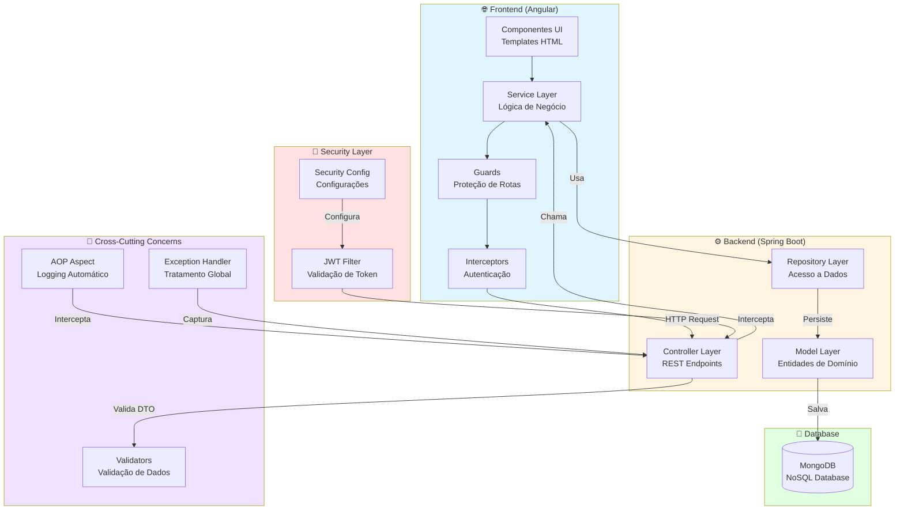

### Detalhamento das Camadas

#### 1. **Frontend Layer (Angular)**

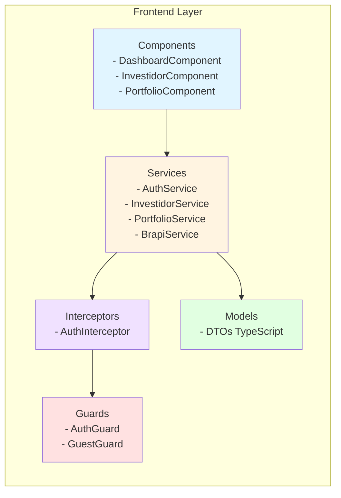

#### 2. **Backend Layer (Spring Boot)**

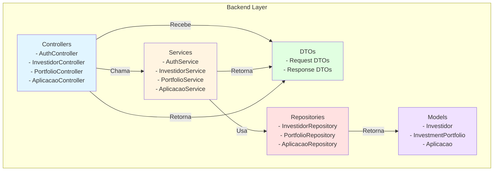

---

## 🔄 Fluxo Completo de Requisição

### Fluxo: Criar Investidor (POST /investors)

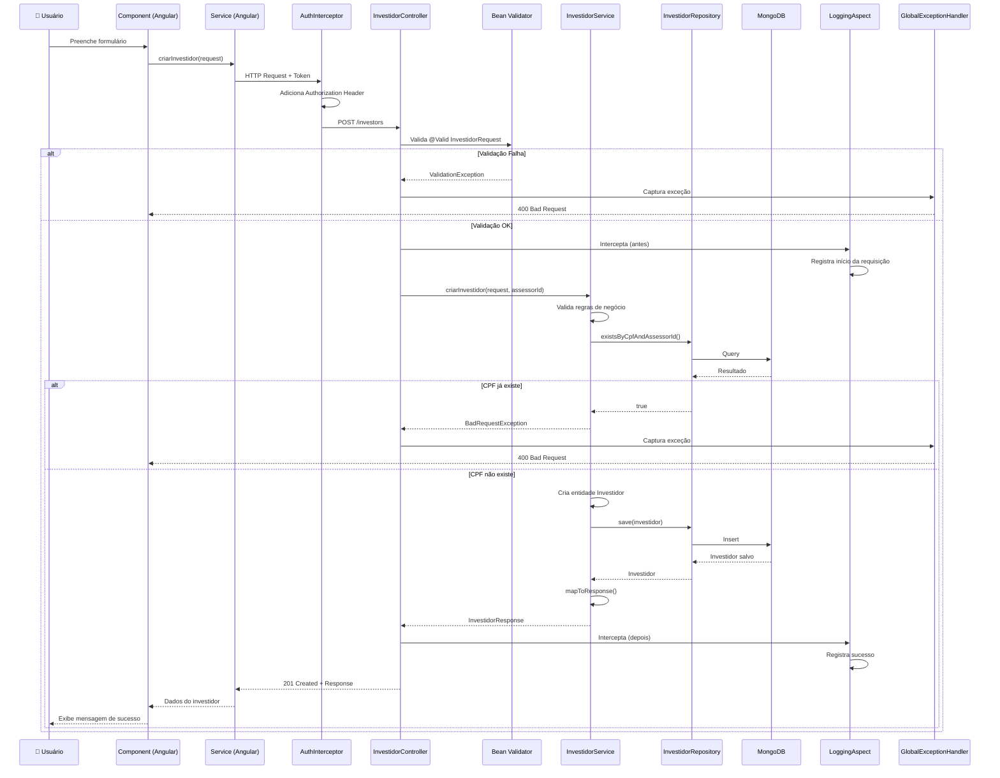

### Fluxo: Listar Investidores (GET /investors)

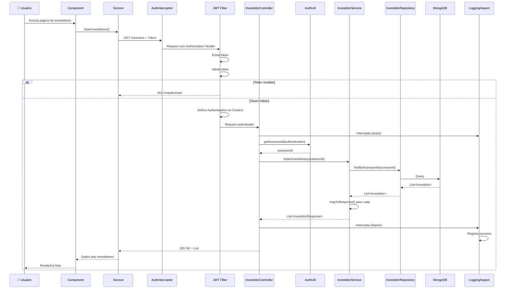

---

## 🔐 Fluxo de Autenticação JWT

### Fluxo: Login e Obtenção de Token

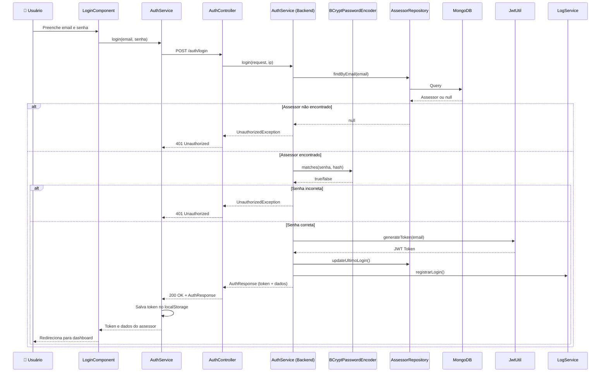

### Fluxo: Validação de Token em Requisições Protegidas

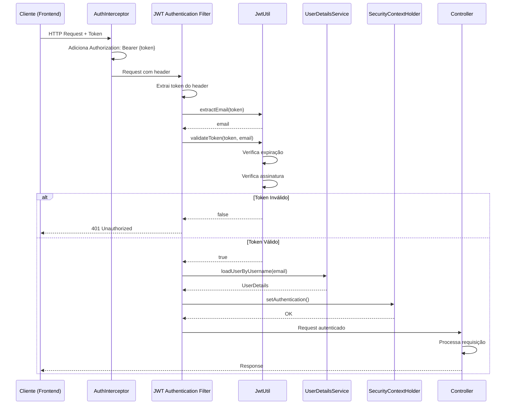

---

## ⚠️ Fluxo de Tratamento de Erros

### Hierarquia de Tratamento de Exceções

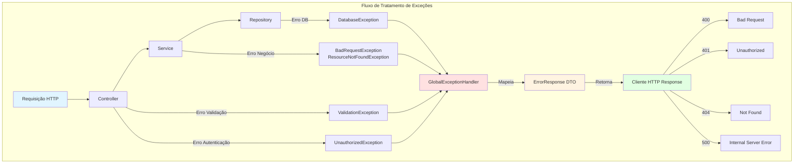

### Fluxo Detalhado: Tratamento de Exceção

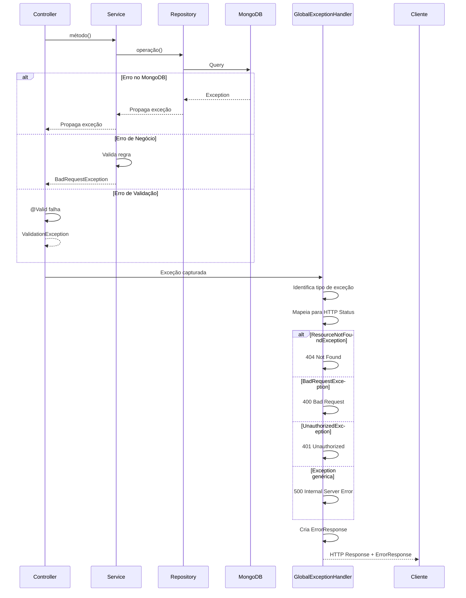

---

## 📝 Fluxo de Logging Automático (AOP)

### Aspecto de Logging Interceptando Controllers

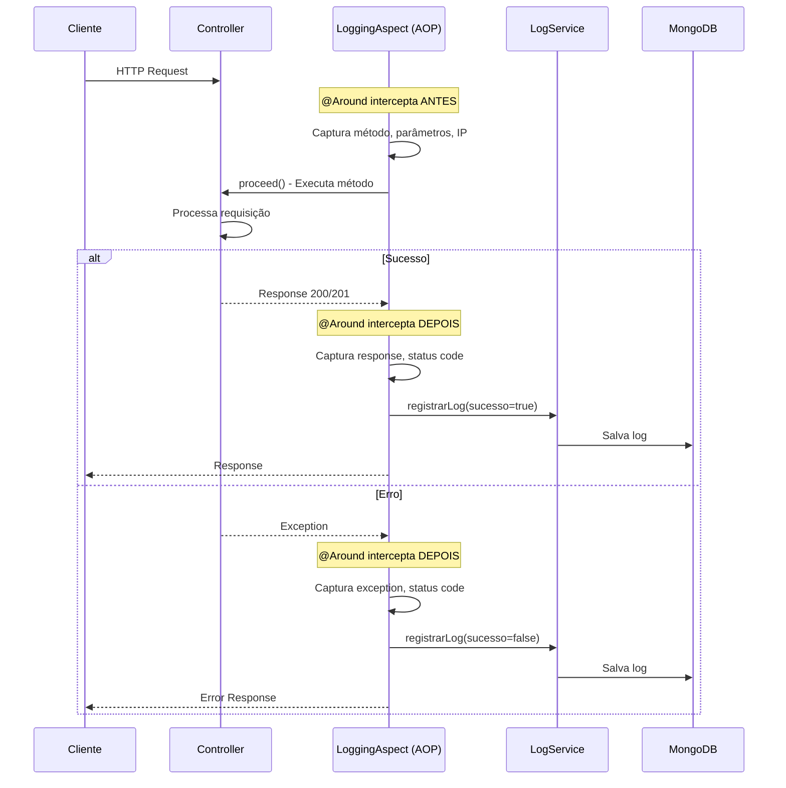

### Estrutura do Logging Aspect

```mermaid
graph TB
    subgraph AOPFlow["Fluxo AOP - Logging"]
        Request[HTTP Request] --> Aspect[LoggingAspect<br/>@Around]
        Aspect -->|Antes| Before[Before Execution<br/>- Captura método<br/>- Captura parâmetros<br/>- Captura IP]
        Before --> Controller[Controller Execution]
        Controller -->|Depois| After[After Execution<br/>- Captura response<br/>- Captura status code<br/>- Captura tempo]
        After --> LogService[LogService]
        LogService --> Log[Log Entity]
        Log --> MongoDB[(MongoDB)]
    end
    
    style Aspect fill:#e1f5ff
    style Before fill:#fff4e1
    style After fill:#ffe1e1
    style LogService fill:#f0e1ff
    style MongoDB fill:#e1ffe1
```

---

## ✅ Fluxo de Validação de Dados

### Validação em Múltiplas Camadas

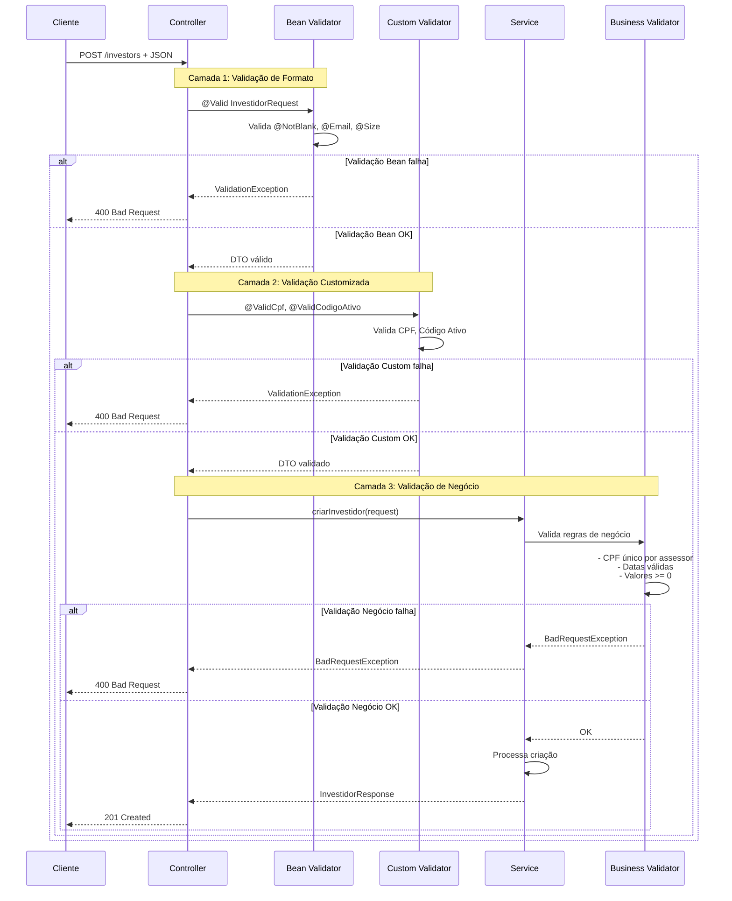

---

## 🌐 Comunicação Frontend-Backend

### Arquitetura de Comunicação Completa

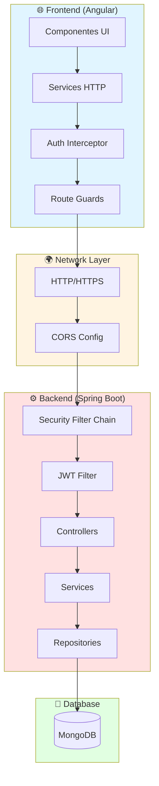

### Fluxo de Dados: Request e Response

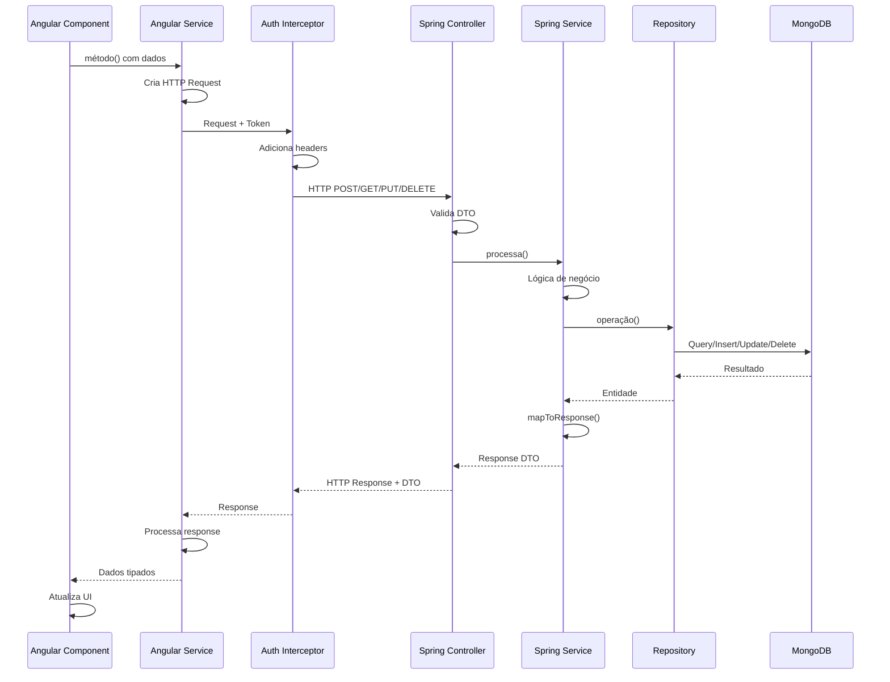

---

## 🎨 Padrões Arquiteturais Aplicados

### 1. Repository Pattern

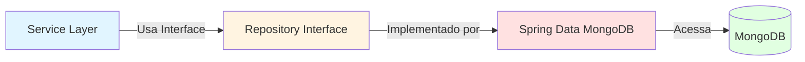

### 2. DTO Pattern

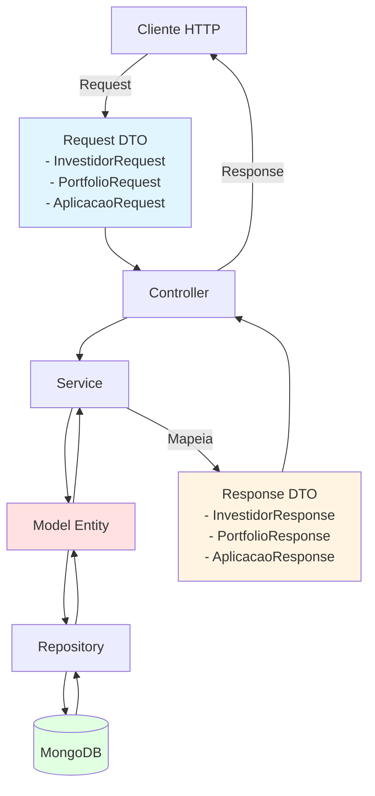

### 3. Dependency Injection

```mermaid
graph TB
    SpringContainer[Spring IoC Container]
    
    SpringContainer --> Controller[Controller]
    SpringContainer --> Service[Service]
    SpringContainer --> Repository[Repository]
    SpringContainer --> Config[Configuration]
    
    Controller -.->|@Autowired| Service
    Service -.->|@Autowired| Repository
    Controller -.->|@Autowired| AuthUtil
    Service -.->|@Autowired| LogService
    
    style SpringContainer fill:#e1f5ff
    style Controller fill:#fff4e1
    style Service fill:#ffe1e1
    style Repository fill:#f0e1ff
```

### 4. Aspect-Oriented Programming (AOP)

```mermaid
graph TB
    Request[HTTP Request] --> Controller[Controller Method]
    Controller -.->|Interceptado por| Aspect[LoggingAspect<br/>@Around]
    Aspect -->|Antes| BeforeAdvice[Before Advice<br/>Captura início]
    BeforeAdvice --> Controller
    Controller -->|Depois| AfterAdvice[After Advice<br/>Captura fim]
    AfterAdvice --> Aspect
    Aspect --> LogService[LogService]
    
    style Aspect fill:#e1f5ff
    style BeforeAdvice fill:#fff4e1
    style AfterAdvice fill:#ffe1e1
    style LogService fill:#f0e1ff
```

---

## 📊 Resumo da Arquitetura

### Camadas e Responsabilidades

| Camada | Responsabilidade | Tecnologias |
|--------|------------------|-------------|
| **Frontend - UI** | Interface do usuário | Angular, HTML, CSS, TypeScript |
| **Frontend - Services** | Comunicação HTTP | Angular HTTP Client, RxJS |
| **Frontend - Guards** | Proteção de rotas | Angular Guards |
| **Frontend - Interceptors** | Interceptação de requisições | Angular Interceptors |
| **Backend - Controllers** | Endpoints REST | Spring MVC, Swagger |
| **Backend - Services** | Lógica de negócio | Spring Services |
| **Backend - Repositories** | Acesso a dados | Spring Data MongoDB |
| **Backend - Models** | Entidades de domínio | MongoDB Documents |
| **Security - JWT Filter** | Autenticação | Spring Security, JWT |
| **Cross-Cutting - AOP** | Logging automático | Spring AOP |
| **Cross-Cutting - Exception Handler** | Tratamento de erros | Spring @ControllerAdvice |
| **Database** | Persistência | MongoDB |

### Fluxo de Dados Resumido

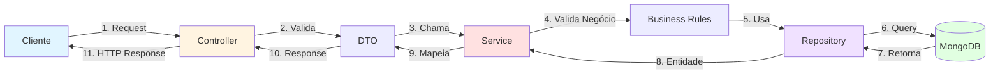

---

## 🔍 Pontos de Interceptação

### Onde Acontecem as Interceptações

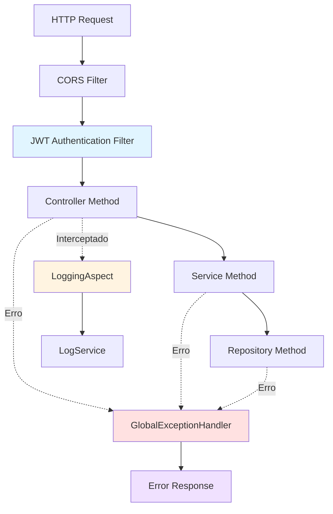

---

## ✅ Benefícios da Arquitetura

### Vantagens da Separação em Camadas

1. **Manutenibilidade**: Fácil localizar e corrigir bugs
2. **Testabilidade**: Cada camada pode ser testada isoladamente
3. **Escalabilidade**: Fácil adicionar novas funcionalidades
4. **Reutilização**: Services e Repositories podem ser reutilizados
5. **Segurança**: Validação em múltiplas camadas
6. **Performance**: Cache e otimizações por camada
7. **Documentação**: Código auto-documentado pela estrutura

---

**Versão do Documento**: 1.0.0  
**Última Atualização**: Janeiro 2025  
**Autor**: Equipe BartoFinance

