# 🏗️ Documentação: Arquitetura e Comunicação entre Camadas

## 📋 Índice

1. [Visão Geral da Arquitetura](#visão-geral-da-arquitetura)
2. [Arquitetura em Camadas](#arquitetura-em-camadas)
3. [Fluxo Completo de Requisição](#fluxo-completo-de-requisição)
4. [Fluxo de Autenticação JWT](#fluxo-de-autenticação-jwt)
5. [Fluxo de Tratamento de Erros](#fluxo-de-tratamento-de-erros)
6. [Fluxo de Logging Automático (AOP)](#fluxo-de-logging-automático-aop)
7. [Fluxo de Validação de Dados](#fluxo-de-validação-de-dados)
8. [Comunicação Frontend-Backend](#comunicação-frontend-backend)
9. [Padrões Arquiteturais Aplicados](#padrões-arquiteturais-aplicados)

---

## 🎯 Visão Geral da Arquitetura

O **BartoFinance** segue uma arquitetura em camadas (Layered Architecture) com separação clara de responsabilidades, facilitando manutenção, testes e escalabilidade.

### Princípios Arquiteturais

- ✅ **Separação de Responsabilidades**: Cada camada tem uma responsabilidade específica
- ✅ **Inversão de Dependências**: Camadas superiores dependem de abstrações
- ✅ **Single Responsibility**: Cada classe tem uma única responsabilidade
- ✅ **Open/Closed Principle**: Aberto para extensão, fechado para modificação
- ✅ **Dependency Injection**: Dependências injetadas via Spring

---

## 🏛️ Arquitetura em Camadas

### Visão Geral das Camadas

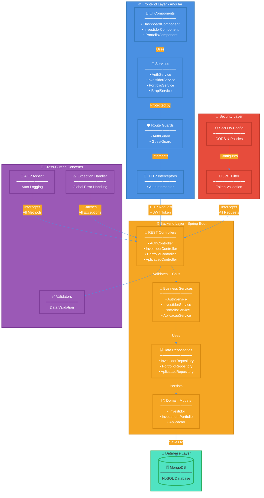
```mermaid
%%{init: {'theme':'base', 'themeVariables': { 'primaryColor':'#4A90E2','primaryTextColor':'#fff','primaryBorderColor':'#357ABD','lineColor':'#4A90E2','secondaryColor':'#F5A623','tertiaryColor':'#50E3C2','background':'#ffffff','mainBkg':'#E8F4F8','textColor':'#333'}}}%%
graph TB
    subgraph Frontend["🌐 Frontend Layer - Angular"]
        direction TB
        UI["🎨 UI Components<br/>━━━━━━━━━━━━━━<br/>• DashboardComponent<br/>• InvestidorComponent<br/>• PortfolioComponent"]
        Services["🔌 Services<br/>━━━━━━━━━━━━━━<br/>• AuthService<br/>• InvestidorService<br/>• PortfolioService<br/>• BrapiService"]
        Guards["🛡️ Route Guards<br/>━━━━━━━━━━━━━━<br/>• AuthGuard<br/>• GuestGuard"]
        Interceptors["🔄 HTTP Interceptors<br/>━━━━━━━━━━━━━━<br/>• AuthInterceptor"]
    end
    
    subgraph Backend["⚙️ Backend Layer - Spring Boot"]
        direction TB
        Controllers["📡 REST Controllers<br/>━━━━━━━━━━━━━━<br/>• AuthController<br/>• InvestidorController<br/>• PortfolioController<br/>• AplicacaoController"]
        ServicesBackend["💼 Business Services<br/>━━━━━━━━━━━━━━<br/>• AuthService<br/>• InvestidorService<br/>• PortfolioService<br/>• AplicacaoService"]
        Repositories["🗄️ Data Repositories<br/>━━━━━━━━━━━━━━<br/>• InvestidorRepository<br/>• PortfolioRepository<br/>• AplicacaoRepository"]
        Models["📦 Domain Models<br/>━━━━━━━━━━━━━━<br/>• Investidor<br/>• InvestmentPortfolio<br/>• Aplicacao"]
    end
    
    subgraph Security["🔐 Security Layer"]
        direction TB
        JWTFilter["🔑 JWT Filter<br/>━━━━━━━━━━━━━━<br/>Token Validation"]
        SecurityConfig["⚙️ Security Config<br/>━━━━━━━━━━━━━━<br/>CORS & Policies"]
    end
    
    subgraph CrossCutting["🔧 Cross-Cutting Concerns"]
        direction TB
        AOP["📝 AOP Aspect<br/>━━━━━━━━━━━━━━<br/>Auto Logging"]
        ExceptionHandler["⚠️ Exception Handler<br/>━━━━━━━━━━━━━━<br/>Global Error Handling"]
        Validators["✅ Validators<br/>━━━━━━━━━━━━━━<br/>Data Validation"]
    end
    
    subgraph Database["💾 Database Layer"]
        direction TB
        MongoDB[("🗄️ MongoDB<br/>━━━━━━━━━━━━━━<br/>NoSQL Database")]
    end
    
    UI -->|"Uses"| Services
    Services -->|"Protected by"| Guards
    Guards -->|"Intercepts"| Interceptors
    Interceptors -->|"HTTP Request<br/>+ JWT Token"| Controllers
    
    Controllers -->|"Validates"| Validators
    Controllers -->|"Calls"| ServicesBackend
    ServicesBackend -->|"Uses"| Repositories
    Repositories -->|"Persists"| Models
    Models -->|"Saves to"| MongoDB
    
    JWTFilter -->|"Intercepts<br/>All Requests"| Controllers
    SecurityConfig -->|"Configures"| JWTFilter
    
    AOP -->|"Intercepts<br/>All Methods"| Controllers
    ExceptionHandler -->|"Catches<br/>All Exceptions"| Controllers
    
    classDef frontendStyle fill:#4A90E2,stroke:#357ABD,stroke-width:3px,color:#fff
    classDef backendStyle fill:#F5A623,stroke:#D68910,stroke-width:3px,color:#fff
    classDef securityStyle fill:#E74C3C,stroke:#C0392B,stroke-width:3px,color:#fff
    classDef crossCuttingStyle fill:#9B59B6,stroke:#7D3C98,stroke-width:3px,color:#fff
    classDef databaseStyle fill:#50E3C2,stroke:#27AE60,stroke-width:3px,color:#333
    
    class Frontend,UI,Services,Guards,Interceptors frontendStyle
    class Backend,Controllers,ServicesBackend,Repositories,Models backendStyle
    class Security,JWTFilter,SecurityConfig securityStyle
    class CrossCutting,AOP,ExceptionHandler,Validators crossCuttingStyle
    class Database,MongoDB databaseStyle
```

### Detalhamento das Camadas

#### 1. **Frontend Layer (Angular)**

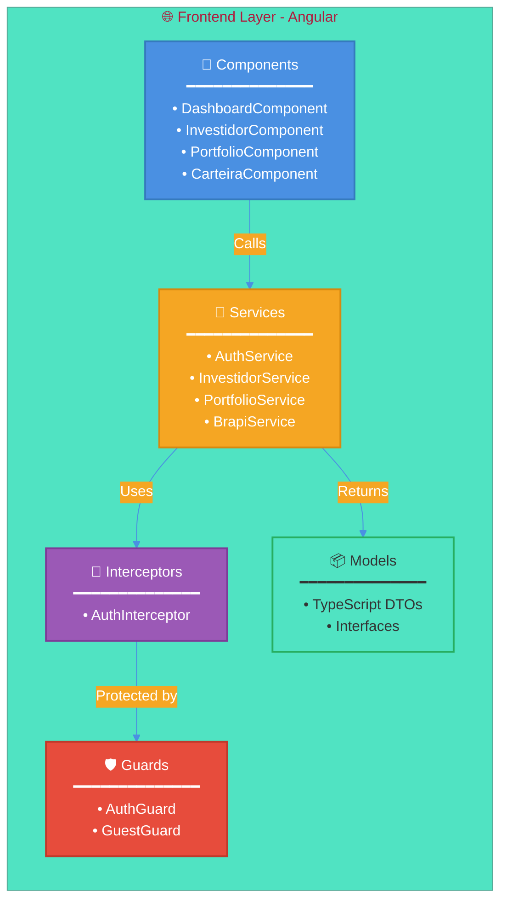
```mermaid
%%{init: {'theme':'base', 'themeVariables': { 'primaryColor':'#4A90E2','primaryTextColor':'#fff','primaryBorderColor':'#357ABD','lineColor':'#4A90E2','secondaryColor':'#F5A623','tertiaryColor':'#50E3C2'}}}%%
graph LR
    subgraph FrontendLayer["🌐 Frontend Layer - Angular"]
        direction TB
        Components["🎨 Components<br/>━━━━━━━━━━━━━━<br/>• DashboardComponent<br/>• InvestidorComponent<br/>• PortfolioComponent<br/>• CarteiraComponent"]
        Services["🔌 Services<br/>━━━━━━━━━━━━━━<br/>• AuthService<br/>• InvestidorService<br/>• PortfolioService<br/>• BrapiService"]
        Guards["🛡️ Guards<br/>━━━━━━━━━━━━━━<br/>• AuthGuard<br/>• GuestGuard"]
        Interceptors["🔄 Interceptors<br/>━━━━━━━━━━━━━━<br/>• AuthInterceptor"]
        Models["📦 Models<br/>━━━━━━━━━━━━━━<br/>• TypeScript DTOs<br/>• Interfaces"]
    end
    
    Components -->|"Calls"| Services
    Services -->|"Uses"| Interceptors
    Interceptors -->|"Protected by"| Guards
    Services -->|"Returns"| Models
    
    classDef componentStyle fill:#4A90E2,stroke:#357ABD,stroke-width:2px,color:#fff
    classDef serviceStyle fill:#F5A623,stroke:#D68910,stroke-width:2px,color:#fff
    classDef guardStyle fill:#E74C3C,stroke:#C0392B,stroke-width:2px,color:#fff
    classDef interceptorStyle fill:#9B59B6,stroke:#7D3C98,stroke-width:2px,color:#fff
    classDef modelStyle fill:#50E3C2,stroke:#27AE60,stroke-width:2px,color:#333
    
    class Components componentStyle
    class Services serviceStyle
    class Guards guardStyle
    class Interceptors interceptorStyle
    class Models modelStyle
```

#### 2. **Backend Layer (Spring Boot)**

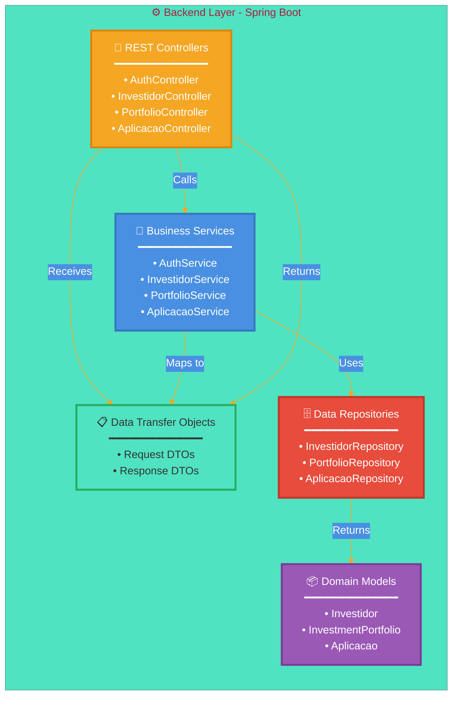
```mermaid
%%{init: {'theme':'base', 'themeVariables': { 'primaryColor':'#F5A623','primaryTextColor':'#fff','primaryBorderColor':'#D68910','lineColor':'#F5A623','secondaryColor':'#4A90E2','tertiaryColor':'#50E3C2'}}}%%
graph TB
    subgraph BackendLayer["⚙️ Backend Layer - Spring Boot"]
        direction TB
        Controllers["📡 REST Controllers<br/>━━━━━━━━━━━━━━<br/>• AuthController<br/>• InvestidorController<br/>• PortfolioController<br/>• AplicacaoController"]
        Services["💼 Business Services<br/>━━━━━━━━━━━━━━<br/>• AuthService<br/>• InvestidorService<br/>• PortfolioService<br/>• AplicacaoService"]
        Repositories["🗄️ Data Repositories<br/>━━━━━━━━━━━━━━<br/>• InvestidorRepository<br/>• PortfolioRepository<br/>• AplicacaoRepository"]
        Models["📦 Domain Models<br/>━━━━━━━━━━━━━━<br/>• Investidor<br/>• InvestmentPortfolio<br/>• Aplicacao"]
        DTOs["📋 Data Transfer Objects<br/>━━━━━━━━━━━━━━<br/>• Request DTOs<br/>• Response DTOs"]
    end
    
    Controllers -->|"Receives"| DTOs
    Controllers -->|"Calls"| Services
    Services -->|"Uses"| Repositories
    Repositories -->|"Returns"| Models
    Services -->|"Maps to"| DTOs
    Controllers -->|"Returns"| DTOs
    
    classDef controllerStyle fill:#F5A623,stroke:#D68910,stroke-width:3px,color:#fff
    classDef serviceStyle fill:#4A90E2,stroke:#357ABD,stroke-width:3px,color:#fff
    classDef repositoryStyle fill:#E74C3C,stroke:#C0392B,stroke-width:3px,color:#fff
    classDef modelStyle fill:#9B59B6,stroke:#7D3C98,stroke-width:3px,color:#fff
    classDef dtoStyle fill:#50E3C2,stroke:#27AE60,stroke-width:3px,color:#333
    
    class Controllers controllerStyle
    class Services serviceStyle
    class Repositories repositoryStyle
    class Models modelStyle
    class DTOs dtoStyle
```

---

## 🔄 Fluxo Completo de Requisição

### Fluxo: Criar Investidor (POST /investors)

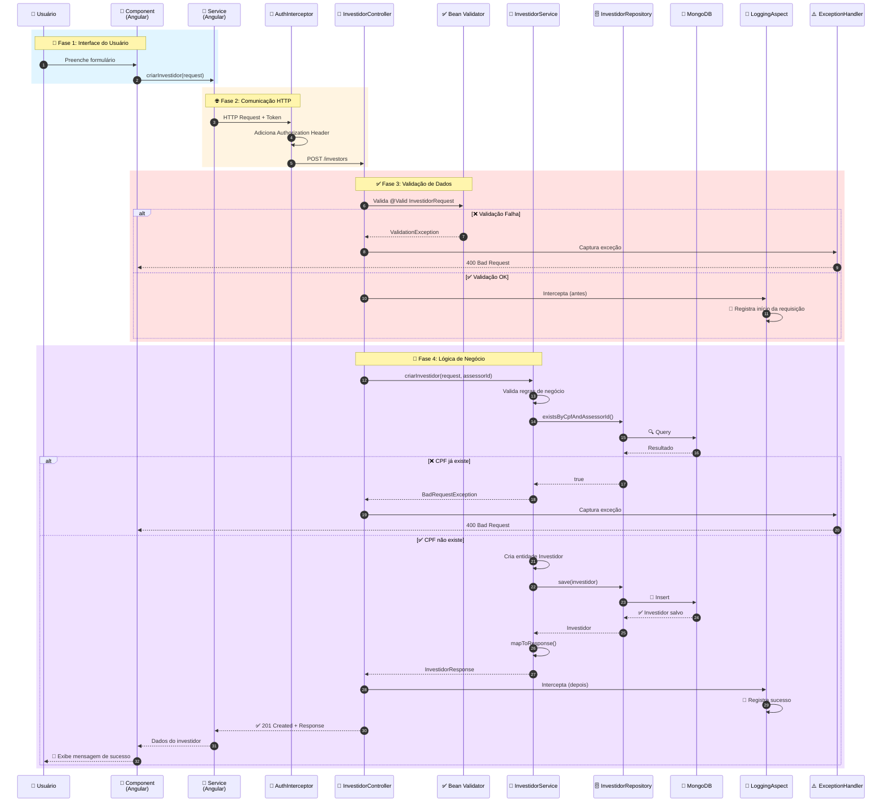
```mermaid
sequenceDiagram
    autonumber
    participant User as 👤 Usuário
    participant Component as 🎨 Component<br/>(Angular)
    participant Service as 🔌 Service<br/>(Angular)
    participant Interceptor as 🔄 AuthInterceptor
    participant Controller as 📡 InvestidorController
    participant Validator as ✅ Bean Validator
    participant ServiceBackend as 💼 InvestidorService
    participant Repository as 🗄️ InvestidorRepository
    participant MongoDB as 💾 MongoDB
    participant AOP as 📝 LoggingAspect
    participant ExceptionHandler as ⚠️ ExceptionHandler

    rect rgb(225, 245, 255)
        Note over User,Component: 🎯 Fase 1: Interface do Usuário
        User->>Component: Preenche formulário
        Component->>Service: criarInvestidor(request)
    end
    
    rect rgb(255, 244, 225)
        Note over Service,Interceptor: 🌐 Fase 2: Comunicação HTTP
        Service->>Interceptor: HTTP Request + Token
        Interceptor->>Interceptor: Adiciona Authorization Header
        Interceptor->>Controller: POST /investors
    end
    
    rect rgb(255, 225, 225)
        Note over Controller,Validator: ✅ Fase 3: Validação de Dados
        Controller->>Validator: Valida @Valid InvestidorRequest
        alt ❌ Validação Falha
            Validator-->>Controller: ValidationException
            Controller->>ExceptionHandler: Captura exceção
            ExceptionHandler-->>Component: 400 Bad Request
        else ✅ Validação OK
            Controller->>AOP: Intercepta (antes)
            AOP->>AOP: 📝 Registra início da requisição
        end
    end
    
    rect rgb(240, 225, 255)
        Note over Controller,ServiceBackend: 💼 Fase 4: Lógica de Negócio
        Controller->>ServiceBackend: criarInvestidor(request, assessorId)
        ServiceBackend->>ServiceBackend: Valida regras de negócio
        ServiceBackend->>Repository: existsByCpfAndAssessorId()
        Repository->>MongoDB: 🔍 Query
        MongoDB-->>Repository: Resultado
        
        alt ❌ CPF já existe
            Repository-->>ServiceBackend: true
            ServiceBackend-->>Controller: BadRequestException
            Controller->>ExceptionHandler: Captura exceção
            ExceptionHandler-->>Component: 400 Bad Request
        else ✅ CPF não existe
            ServiceBackend->>ServiceBackend: Cria entidade Investidor
            ServiceBackend->>Repository: save(investidor)
            Repository->>MongoDB: 💾 Insert
            MongoDB-->>Repository: ✅ Investidor salvo
            Repository-->>ServiceBackend: Investidor
            ServiceBackend->>ServiceBackend: mapToResponse()
            ServiceBackend-->>Controller: InvestidorResponse
            Controller->>AOP: Intercepta (depois)
            AOP->>AOP: 📝 Registra sucesso
            Controller-->>Service: ✅ 201 Created + Response
            Service-->>Component: Dados do investidor
            Component-->>User: 🎉 Exibe mensagem de sucesso
        end
    end
```

### Fluxo: Listar Investidores (GET /investors)

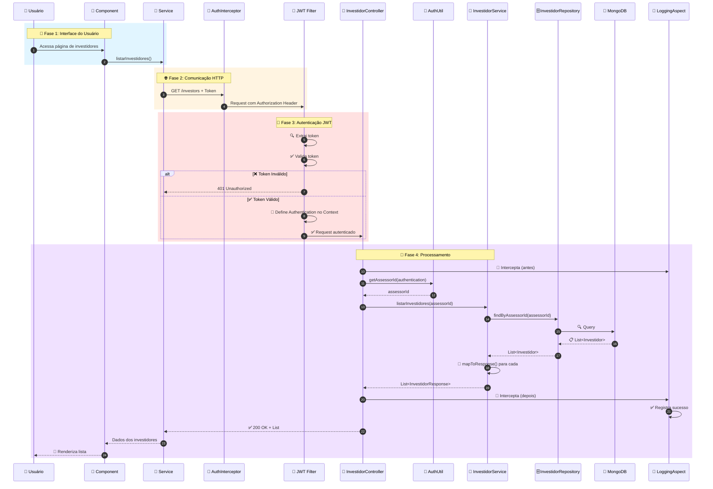
```mermaid
sequenceDiagram
    autonumber
    participant User as 👤 Usuário
    participant Component as 🎨 Component
    participant Service as 🔌 Service
    participant Interceptor as 🔄 AuthInterceptor
    participant JWTFilter as 🔑 JWT Filter
    participant Controller as 📡 InvestidorController
    participant AuthUtil as 🔐 AuthUtil
    participant ServiceBackend as 💼 InvestidorService
    participant Repository as 🗄️ InvestidorRepository
    participant MongoDB as 💾 MongoDB
    participant AOP as 📝 LoggingAspect

    rect rgb(225, 245, 255)
        Note over User,Component: 🎯 Fase 1: Interface do Usuário
        User->>Component: Acessa página de investidores
        Component->>Service: listarInvestidores()
    end
    
    rect rgb(255, 244, 225)
        Note over Service,Interceptor: 🌐 Fase 2: Comunicação HTTP
        Service->>Interceptor: GET /investors + Token
        Interceptor->>JWTFilter: Request com Authorization Header
    end
    
    rect rgb(255, 225, 225)
        Note over JWTFilter,JWTFilter: 🔐 Fase 3: Autenticação JWT
        JWTFilter->>JWTFilter: 🔍 Extrai token
        JWTFilter->>JWTFilter: ✅ Valida token
        
        alt ❌ Token Inválido
            JWTFilter-->>Service: 401 Unauthorized
        else ✅ Token Válido
            JWTFilter->>JWTFilter: 🔐 Define Authentication no Context
            JWTFilter->>Controller: ✅ Request autenticado
        end
    end
    
    rect rgb(240, 225, 255)
        Note over Controller,ServiceBackend: 💼 Fase 4: Processamento
        Controller->>AOP: 📝 Intercepta (antes)
        Controller->>AuthUtil: getAssessorId(authentication)
        AuthUtil-->>Controller: assessorId
        Controller->>ServiceBackend: listarInvestidores(assessorId)
        ServiceBackend->>Repository: findByAssessorId(assessorId)
        Repository->>MongoDB: 🔍 Query
        MongoDB-->>Repository: 📋 List<Investidor>
        Repository-->>ServiceBackend: List<Investidor>
        ServiceBackend->>ServiceBackend: 🔄 mapToResponse() para cada
        ServiceBackend-->>Controller: List<InvestidorResponse>
        Controller->>AOP: 📝 Intercepta (depois)
        AOP->>AOP: ✅ Registra sucesso
        Controller-->>Service: ✅ 200 OK + List
        Service-->>Component: Dados dos investidores
        Component-->>User: 🎨 Renderiza lista
    end
```

---

## 🔐 Fluxo de Autenticação JWT

### Fluxo: Login e Obtenção de Token

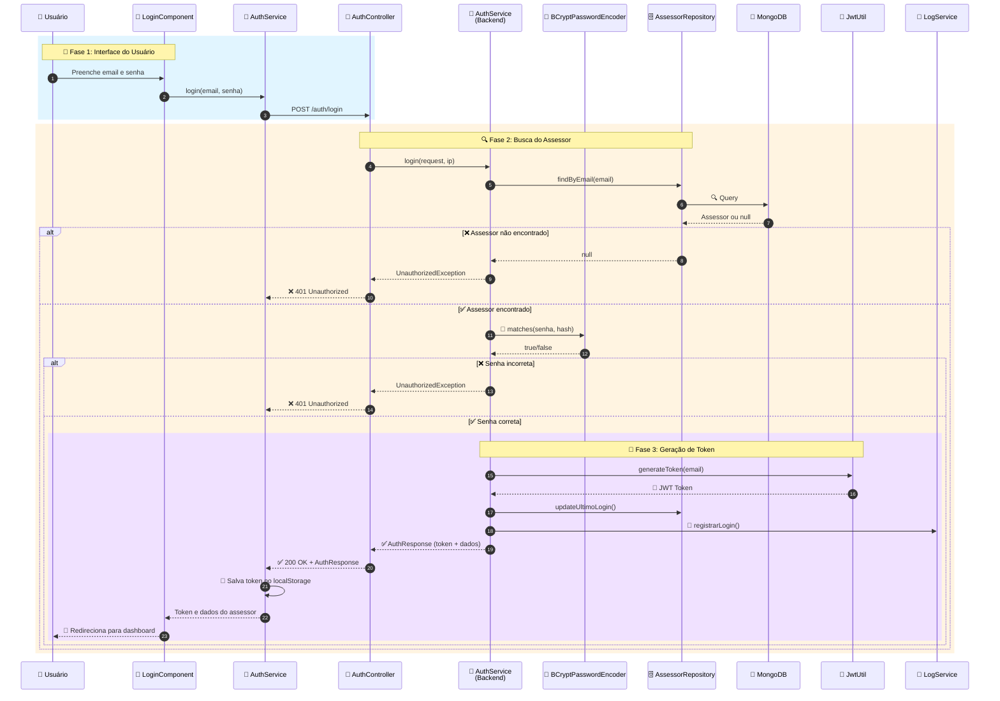
```mermaid
sequenceDiagram
    autonumber
    participant User as 👤 Usuário
    participant Component as 🎨 LoginComponent
    participant Service as 🔌 AuthService
    participant Controller as 📡 AuthController
    participant AuthServiceBackend as 💼 AuthService<br/>(Backend)
    participant PasswordEncoder as 🔐 BCryptPasswordEncoder
    participant Repository as 🗄️ AssessorRepository
    participant MongoDB as 💾 MongoDB
    participant JwtUtil as 🎫 JwtUtil
    participant LogService as 📝 LogService

    rect rgb(225, 245, 255)
        Note over User,Component: 🎯 Fase 1: Interface do Usuário
        User->>Component: Preenche email e senha
        Component->>Service: login(email, senha)
        Service->>Controller: POST /auth/login
    end
    
    rect rgb(255, 244, 225)
        Note over Controller,Repository: 🔍 Fase 2: Busca do Assessor
        Controller->>AuthServiceBackend: login(request, ip)
        AuthServiceBackend->>Repository: findByEmail(email)
        Repository->>MongoDB: 🔍 Query
        MongoDB-->>Repository: Assessor ou null
        
        alt ❌ Assessor não encontrado
            Repository-->>AuthServiceBackend: null
            AuthServiceBackend-->>Controller: UnauthorizedException
            Controller-->>Service: ❌ 401 Unauthorized
        else ✅ Assessor encontrado
            AuthServiceBackend->>PasswordEncoder: 🔐 matches(senha, hash)
            PasswordEncoder-->>AuthServiceBackend: true/false
            
            alt ❌ Senha incorreta
                AuthServiceBackend-->>Controller: UnauthorizedException
                Controller-->>Service: ❌ 401 Unauthorized
            else ✅ Senha correta
                rect rgb(240, 225, 255)
                    Note over AuthServiceBackend,JwtUtil: 🎫 Fase 3: Geração de Token
                    AuthServiceBackend->>JwtUtil: generateToken(email)
                    JwtUtil-->>AuthServiceBackend: 🎫 JWT Token
                    AuthServiceBackend->>Repository: updateUltimoLogin()
                    AuthServiceBackend->>LogService: 📝 registrarLogin()
                    AuthServiceBackend-->>Controller: ✅ AuthResponse (token + dados)
                    Controller-->>Service: ✅ 200 OK + AuthResponse
                    Service->>Service: 💾 Salva token no localStorage
                    Service-->>Component: Token e dados do assessor
                    Component-->>User: 🎉 Redireciona para dashboard
                end
            end
        end
    end
```

### Fluxo: Validação de Token em Requisições Protegidas

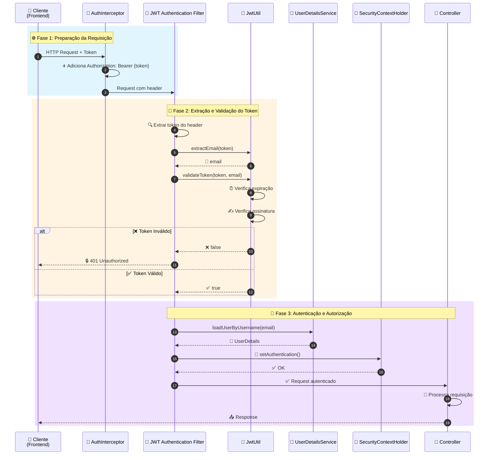
```mermaid
sequenceDiagram
    autonumber
    participant Client as 👤 Cliente<br/>(Frontend)
    participant Interceptor as 🔄 AuthInterceptor
    participant JWTFilter as 🔑 JWT Authentication Filter
    participant JwtUtil as 🎫 JwtUtil
    participant UserDetailsService as 👤 UserDetailsService
    participant SecurityContext as 🔐 SecurityContextHolder
    participant Controller as 📡 Controller

    rect rgb(225, 245, 255)
        Note over Client,Interceptor: 🌐 Fase 1: Preparação da Requisição
        Client->>Interceptor: HTTP Request + Token
        Interceptor->>Interceptor: ➕ Adiciona Authorization: Bearer {token}
        Interceptor->>JWTFilter: Request com header
    end
    
    rect rgb(255, 244, 225)
        Note over JWTFilter,JwtUtil: 🔑 Fase 2: Extração e Validação do Token
        JWTFilter->>JWTFilter: 🔍 Extrai token do header
        JWTFilter->>JwtUtil: extractEmail(token)
        JwtUtil-->>JWTFilter: 📧 email
        
        JWTFilter->>JwtUtil: validateToken(token, email)
        JwtUtil->>JwtUtil: ⏰ Verifica expiração
        JwtUtil->>JwtUtil: ✍️ Verifica assinatura
        
        alt ❌ Token Inválido
            JwtUtil-->>JWTFilter: ❌ false
            JWTFilter-->>Client: 🔒 401 Unauthorized
        else ✅ Token Válido
            JwtUtil-->>JWTFilter: ✅ true
        end
    end
    
    rect rgb(240, 225, 255)
        Note over JWTFilter,Controller: 🔐 Fase 3: Autenticação e Autorização
        JWTFilter->>UserDetailsService: loadUserByUsername(email)
        UserDetailsService-->>JWTFilter: 👤 UserDetails
        JWTFilter->>SecurityContext: 🔐 setAuthentication()
        SecurityContext-->>JWTFilter: ✅ OK
        JWTFilter->>Controller: ✅ Request autenticado
        Controller->>Controller: 💼 Processa requisição
        Controller-->>Client: 📤 Response
    end
```

---

## ⚠️ Fluxo de Tratamento de Erros

### Hierarquia de Tratamento de Exceções

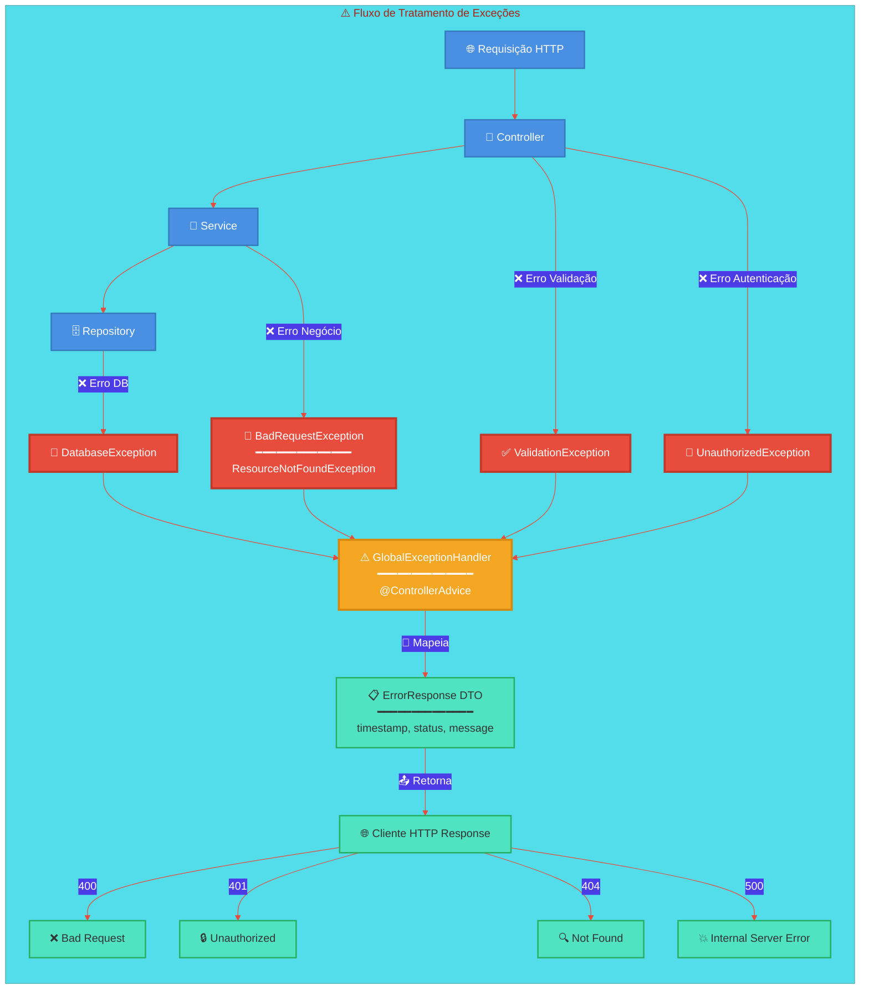
```mermaid
%%{init: {'theme':'base', 'themeVariables': { 'primaryColor':'#E74C3C','primaryTextColor':'#fff','primaryBorderColor':'#C0392B','lineColor':'#E74C3C'}}}%%
graph TB
    subgraph ExceptionFlow["⚠️ Fluxo de Tratamento de Exceções"]
        direction TB
        Request["🌐 Requisição HTTP"]
        Controller["📡 Controller"]
        Service["💼 Service"]
        Repository["🗄️ Repository"]
        
        Request --> Controller
        Controller --> Service
        Service --> Repository
        
        Repository -->|"❌ Erro DB"| DBException["💾 DatabaseException"]
        Service -->|"❌ Erro Negócio"| BusinessException["💼 BadRequestException<br/>━━━━━━━━━━━━━━<br/>ResourceNotFoundException"]
        Controller -->|"❌ Erro Validação"| ValidationException["✅ ValidationException"]
        Controller -->|"❌ Erro Autenticação"| AuthException["🔐 UnauthorizedException"]
        
        DBException --> ExceptionHandler["⚠️ GlobalExceptionHandler<br/>━━━━━━━━━━━━━━<br/>@ControllerAdvice"]
        BusinessException --> ExceptionHandler
        ValidationException --> ExceptionHandler
        AuthException --> ExceptionHandler
        
        ExceptionHandler -->|"🔄 Mapeia"| ErrorResponse["📋 ErrorResponse DTO<br/>━━━━━━━━━━━━━━<br/>timestamp, status, message"]
        ErrorResponse -->|"📤 Retorna"| Client["🌐 Cliente HTTP Response"]
        
        Client -->|"400"| BadRequest["❌ Bad Request"]
        Client -->|"401"| Unauthorized["🔒 Unauthorized"]
        Client -->|"404"| NotFound["🔍 Not Found"]
        Client -->|"500"| ServerError["💥 Internal Server Error"]
    end
    
    classDef requestStyle fill:#4A90E2,stroke:#357ABD,stroke-width:2px,color:#fff
    classDef exceptionStyle fill:#E74C3C,stroke:#C0392B,stroke-width:3px,color:#fff
    classDef handlerStyle fill:#F5A623,stroke:#D68910,stroke-width:3px,color:#fff
    classDef responseStyle fill:#50E3C2,stroke:#27AE60,stroke-width:2px,color:#333
    
    class Request,Controller,Service,Repository requestStyle
    class DBException,BusinessException,ValidationException,AuthException exceptionStyle
    class ExceptionHandler handlerStyle
    class ErrorResponse,Client,BadRequest,Unauthorized,NotFound,ServerError responseStyle
```

### Fluxo Detalhado: Tratamento de Exceção

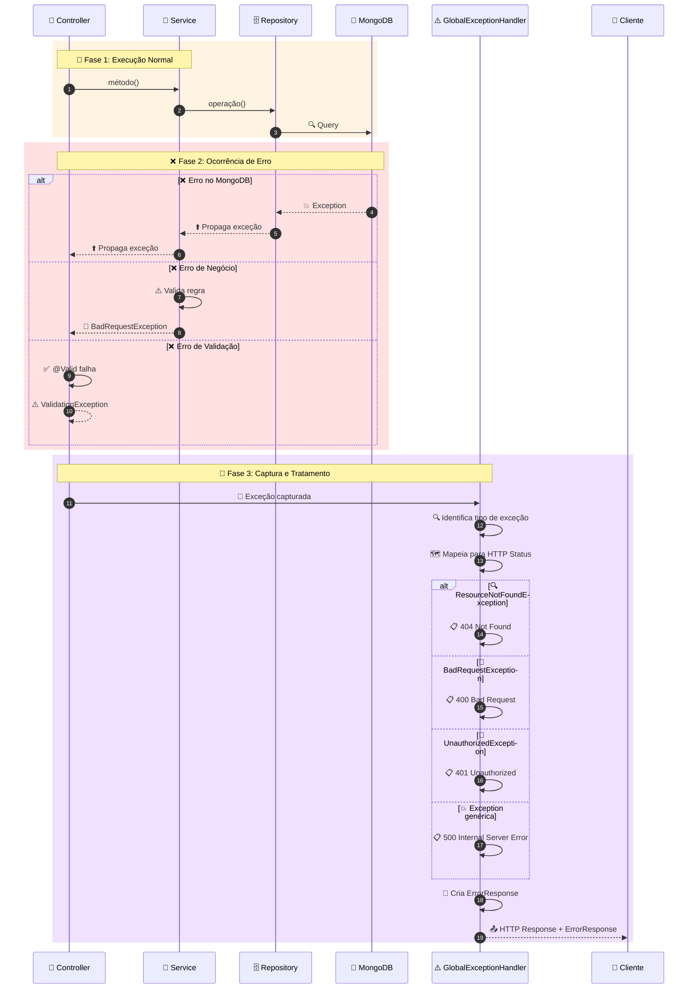
```mermaid
sequenceDiagram
    autonumber
    participant Controller as 📡 Controller
    participant Service as 💼 Service
    participant Repository as 🗄️ Repository
    participant MongoDB as 💾 MongoDB
    participant ExceptionHandler as ⚠️ GlobalExceptionHandler
    participant Client as 👤 Cliente

    rect rgb(255, 244, 225)
        Note over Controller,Service: 💼 Fase 1: Execução Normal
        Controller->>Service: método()
        Service->>Repository: operação()
        Repository->>MongoDB: 🔍 Query
    end
    
    rect rgb(255, 225, 225)
        Note over MongoDB,Controller: ❌ Fase 2: Ocorrência de Erro
        alt ❌ Erro no MongoDB
            MongoDB-->>Repository: 💥 Exception
            Repository-->>Service: ⬆️ Propaga exceção
            Service-->>Controller: ⬆️ Propaga exceção
        else ❌ Erro de Negócio
            Service->>Service: ⚠️ Valida regra
            Service-->>Controller: 💼 BadRequestException
        else ❌ Erro de Validação
            Controller->>Controller: ✅ @Valid falha
            Controller-->>Controller: ⚠️ ValidationException
        end
    end
    
    rect rgb(240, 225, 255)
        Note over Controller,ExceptionHandler: 🔄 Fase 3: Captura e Tratamento
        Controller->>ExceptionHandler: 🎯 Exceção capturada
        ExceptionHandler->>ExceptionHandler: 🔍 Identifica tipo de exceção
        ExceptionHandler->>ExceptionHandler: 🗺️ Mapeia para HTTP Status
        
        alt 🔍 ResourceNotFoundException
            ExceptionHandler->>ExceptionHandler: 📋 404 Not Found
        else 💼 BadRequestException
            ExceptionHandler->>ExceptionHandler: 📋 400 Bad Request
        else 🔐 UnauthorizedException
            ExceptionHandler->>ExceptionHandler: 📋 401 Unauthorized
        else 💥 Exception genérica
            ExceptionHandler->>ExceptionHandler: 📋 500 Internal Server Error
        end
        
        ExceptionHandler->>ExceptionHandler: 📝 Cria ErrorResponse
        ExceptionHandler-->>Client: 📤 HTTP Response + ErrorResponse
    end
```

---

## 📝 Fluxo de Logging Automático (AOP)

### Aspecto de Logging Interceptando Controllers

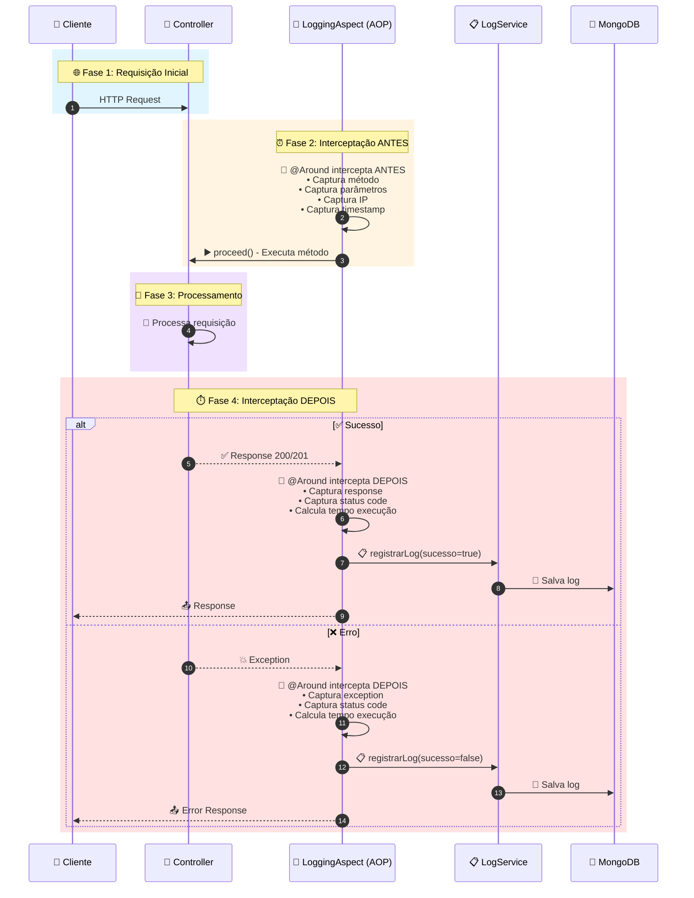
```mermaid
sequenceDiagram
    autonumber
    participant Client as 👤 Cliente
    participant Controller as 📡 Controller
    participant LoggingAspect as 📝 LoggingAspect (AOP)
    participant LogService as 📋 LogService
    participant MongoDB as 💾 MongoDB

    rect rgb(225, 245, 255)
        Note over Client,Controller: 🌐 Fase 1: Requisição Inicial
        Client->>Controller: HTTP Request
    end
    
    rect rgb(255, 244, 225)
        Note over LoggingAspect,LoggingAspect: ⏰ Fase 2: Interceptação ANTES
        LoggingAspect->>LoggingAspect: 📝 @Around intercepta ANTES<br/>• Captura método<br/>• Captura parâmetros<br/>• Captura IP<br/>• Captura timestamp
        LoggingAspect->>Controller: ▶️ proceed() - Executa método
    end
    
    rect rgb(240, 225, 255)
        Note over Controller,Controller: 💼 Fase 3: Processamento
        Controller->>Controller: 💼 Processa requisição
    end
    
    rect rgb(255, 225, 225)
        Note over Controller,LoggingAspect: ⏱️ Fase 4: Interceptação DEPOIS
        alt ✅ Sucesso
            Controller-->>LoggingAspect: ✅ Response 200/201
            LoggingAspect->>LoggingAspect: 📝 @Around intercepta DEPOIS<br/>• Captura response<br/>• Captura status code<br/>• Calcula tempo execução
            LoggingAspect->>LogService: 📋 registrarLog(sucesso=true)
            LogService->>MongoDB: 💾 Salva log
            LoggingAspect-->>Client: 📤 Response
        else ❌ Erro
            Controller-->>LoggingAspect: 💥 Exception
            LoggingAspect->>LoggingAspect: 📝 @Around intercepta DEPOIS<br/>• Captura exception<br/>• Captura status code<br/>• Calcula tempo execução
            LoggingAspect->>LogService: 📋 registrarLog(sucesso=false)
            LogService->>MongoDB: 💾 Salva log
            LoggingAspect-->>Client: 📤 Error Response
        end
    end
```

### Estrutura do Logging Aspect

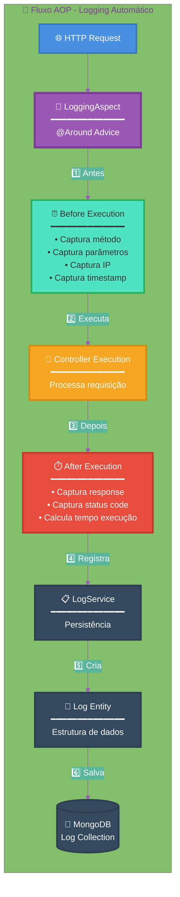
```mermaid
%%{init: {'theme':'base', 'themeVariables': { 'primaryColor':'#9B59B6','primaryTextColor':'#fff','primaryBorderColor':'#7D3C98','lineColor':'#9B59B6'}}}%%
graph TB
    subgraph AOPFlow["📝 Fluxo AOP - Logging Automático"]
        direction TB
        Request["🌐 HTTP Request"]
        Aspect["📝 LoggingAspect<br/>━━━━━━━━━━━━━━<br/>@Around Advice"]
        Before["⏰ Before Execution<br/>━━━━━━━━━━━━━━<br/>• Captura método<br/>• Captura parâmetros<br/>• Captura IP<br/>• Captura timestamp"]
        Controller["📡 Controller Execution<br/>━━━━━━━━━━━━━━<br/>Processa requisição"]
        After["⏱️ After Execution<br/>━━━━━━━━━━━━━━<br/>• Captura response<br/>• Captura status code<br/>• Calcula tempo execução"]
        LogService["📋 LogService<br/>━━━━━━━━━━━━━━<br/>Persistência"]
        Log["📝 Log Entity<br/>━━━━━━━━━━━━━━<br/>Estrutura de dados"]
        MongoDB[("💾 MongoDB<br/>Log Collection")]
        
        Request --> Aspect
        Aspect -->|"1️⃣ Antes"| Before
        Before -->|"2️⃣ Executa"| Controller
        Controller -->|"3️⃣ Depois"| After
        After -->|"4️⃣ Registra"| LogService
        LogService -->|"5️⃣ Cria"| Log
        Log -->|"6️⃣ Salva"| MongoDB
    end
    
    classDef requestStyle fill:#4A90E2,stroke:#357ABD,stroke-width:3px,color:#fff
    classDef aspectStyle fill:#9B59B6,stroke:#7D3C98,stroke-width:4px,color:#fff
    classDef beforeStyle fill:#50E3C2,stroke:#27AE60,stroke-width:3px,color:#333
    classDef controllerStyle fill:#F5A623,stroke:#D68910,stroke-width:3px,color:#fff
    classDef afterStyle fill:#E74C3C,stroke:#C0392B,stroke-width:3px,color:#fff
    classDef logStyle fill:#34495E,stroke:#2C3E50,stroke-width:3px,color:#fff
    
    class Request requestStyle
    class Aspect aspectStyle
    class Before beforeStyle
    class Controller controllerStyle
    class After afterStyle
    class LogService,Log logStyle
    class MongoDB logStyle
```

---

## ✅ Fluxo de Validação de Dados

### Validação em Múltiplas Camadas

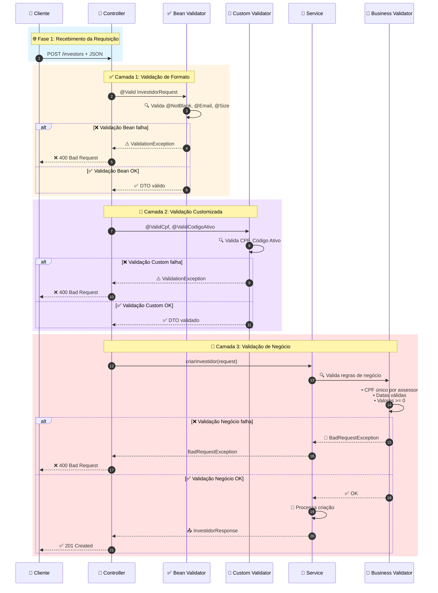
```mermaid
sequenceDiagram
    autonumber
    participant Client as 👤 Cliente
    participant Controller as 📡 Controller
    participant BeanValidator as ✅ Bean Validator
    participant CustomValidator as 🔧 Custom Validator
    participant Service as 💼 Service
    participant BusinessValidator as 💼 Business Validator

    rect rgb(225, 245, 255)
        Note over Client,Controller: 🌐 Fase 1: Recebimento da Requisição
        Client->>Controller: POST /investors + JSON
    end
    
    rect rgb(255, 244, 225)
        Note over Controller,BeanValidator: ✅ Camada 1: Validação de Formato
        Controller->>BeanValidator: @Valid InvestidorRequest
        BeanValidator->>BeanValidator: 🔍 Valida @NotBlank, @Email, @Size
        
        alt ❌ Validação Bean falha
            BeanValidator-->>Controller: ⚠️ ValidationException
            Controller-->>Client: ❌ 400 Bad Request
        else ✅ Validação Bean OK
            BeanValidator-->>Controller: ✅ DTO válido
        end
    end
    
    rect rgb(240, 225, 255)
        Note over Controller,CustomValidator: 🔧 Camada 2: Validação Customizada
        Controller->>CustomValidator: @ValidCpf, @ValidCodigoAtivo
        CustomValidator->>CustomValidator: 🔍 Valida CPF, Código Ativo
        
        alt ❌ Validação Custom falha
            CustomValidator-->>Controller: ⚠️ ValidationException
            Controller-->>Client: ❌ 400 Bad Request
        else ✅ Validação Custom OK
            CustomValidator-->>Controller: ✅ DTO validado
        end
    end
    
    rect rgb(255, 225, 225)
        Note over Controller,BusinessValidator: 💼 Camada 3: Validação de Negócio
        Controller->>Service: criarInvestidor(request)
        Service->>BusinessValidator: 🔍 Valida regras de negócio
        BusinessValidator->>BusinessValidator: • CPF único por assessor<br/>• Datas válidas<br/>• Valores >= 0
        
        alt ❌ Validação Negócio falha
            BusinessValidator-->>Service: 💼 BadRequestException
            Service-->>Controller: BadRequestException
            Controller-->>Client: ❌ 400 Bad Request
        else ✅ Validação Negócio OK
            BusinessValidator-->>Service: ✅ OK
            Service->>Service: 💾 Processa criação
            Service-->>Controller: 📤 InvestidorResponse
            Controller-->>Client: ✅ 201 Created
        end
    end
```

---

## 🌐 Comunicação Frontend-Backend

### Arquitetura de Comunicação Completa

```mermaid
%%{init: {'theme':'base', 'themeVariables': { 'primaryColor':'#4A90E2','primaryTextColor':'#fff','primaryBorderColor':'#357ABD','lineColor':'#4A90E2'}}}%%
graph TB
    subgraph Frontend["🌐 Frontend Layer - Angular"]
        direction TB
        UI["🎨 Componentes UI<br/>━━━━━━━━━━━━━━<br/>Templates & Components"]
        Services["🔌 Services HTTP<br/>━━━━━━━━━━━━━━<br/>HTTP Clients"]
        Interceptor["🔄 Auth Interceptor<br/>━━━━━━━━━━━━━━<br/>Token Injection"]
        Guards["🛡️ Route Guards<br/>━━━━━━━━━━━━━━<br/>Route Protection"]
    end
    
    subgraph Network["🌍 Network Layer"]
        direction TB
        HTTP["📡 HTTP/HTTPS<br/>━━━━━━━━━━━━━━<br/>Protocol"]
        CORS["🌐 CORS Config<br/>━━━━━━━━━━━━━━<br/>Cross-Origin"]
    end
    
    subgraph Backend["⚙️ Backend Layer - Spring Boot"]
        direction TB
        Security["🔐 Security Filter Chain<br/>━━━━━━━━━━━━━━<br/>Security Pipeline"]
        JWTFilter["🔑 JWT Filter<br/>━━━━━━━━━━━━━━<br/>Token Validation"]
        Controller["📡 Controllers<br/>━━━━━━━━━━━━━━<br/>REST Endpoints"]
        Service["💼 Services<br/>━━━━━━━━━━━━━━<br/>Business Logic"]
        Repository["🗄️ Repositories<br/>━━━━━━━━━━━━━━<br/>Data Access"]
    end
    
    subgraph Database["💾 Database Layer"]
        direction TB
        MongoDB[("🗄️ MongoDB<br/>━━━━━━━━━━━━━━<br/>NoSQL Database")]
    end
    
    UI -->|"Uses"| Services
    Services -->|"Protected by"| Interceptor
    Interceptor -->|"Validates"| Guards
    Guards -->|"Sends"| HTTP
    HTTP -->|"Through"| CORS
    CORS -->|"To"| Security
    Security -->|"Validates"| JWTFilter
    JWTFilter -->|"Routes to"| Controller
    Controller -->|"Calls"| Service
    Service -->|"Uses"| Repository
    Repository -->|"Queries"| MongoDB
    
    classDef frontendStyle fill:#4A90E2,stroke:#357ABD,stroke-width:3px,color:#fff
    classDef networkStyle fill:#F5A623,stroke:#D68910,stroke-width:3px,color:#fff
    classDef backendStyle fill:#E74C3C,stroke:#C0392B,stroke-width:3px,color:#fff
    classDef databaseStyle fill:#50E3C2,stroke:#27AE60,stroke-width:3px,color:#333
    
    class Frontend,UI,Services,Interceptor,Guards frontendStyle
    class Network,HTTP,CORS networkStyle
    class Backend,Security,JWTFilter,Controller,Service,Repository backendStyle
    class Database,MongoDB databaseStyle
```

### Fluxo de Dados: Request e Response

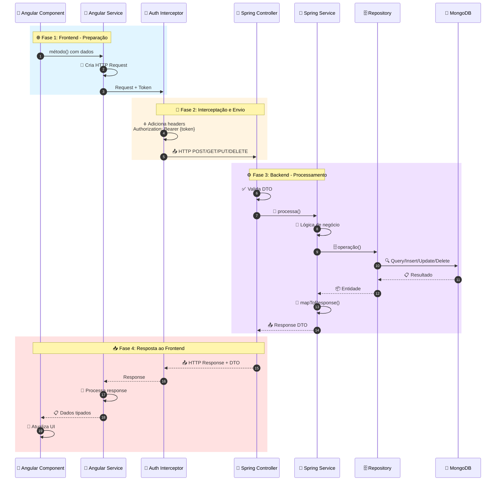
```mermaid
sequenceDiagram
    autonumber
    participant Component as 🎨 Angular Component
    participant Service as 🔌 Angular Service
    participant Interceptor as 🔄 Auth Interceptor
    participant Controller as 📡 Spring Controller
    participant ServiceBackend as 💼 Spring Service
    participant Repository as 🗄️ Repository
    participant MongoDB as 💾 MongoDB

    rect rgb(225, 245, 255)
        Note over Component,Service: 🌐 Fase 1: Frontend - Preparação
        Component->>Service: método() com dados
        Service->>Service: 📝 Cria HTTP Request
        Service->>Interceptor: Request + Token
    end
    
    rect rgb(255, 244, 225)
        Note over Interceptor,Controller: 🔄 Fase 2: Interceptação e Envio
        Interceptor->>Interceptor: ➕ Adiciona headers<br/>Authorization: Bearer {token}
        Interceptor->>Controller: 📤 HTTP POST/GET/PUT/DELETE
    end
    
    rect rgb(240, 225, 255)
        Note over Controller,ServiceBackend: ⚙️ Fase 3: Backend - Processamento
        Controller->>Controller: ✅ Valida DTO
        Controller->>ServiceBackend: 💼 processa()
        ServiceBackend->>ServiceBackend: 🔧 Lógica de negócio
        ServiceBackend->>Repository: 🗄️ operação()
        Repository->>MongoDB: 🔍 Query/Insert/Update/Delete
        MongoDB-->>Repository: 📋 Resultado
        Repository-->>ServiceBackend: 📦 Entidade
        ServiceBackend->>ServiceBackend: 🔄 mapToResponse()
        ServiceBackend-->>Controller: 📤 Response DTO
    end
    
    rect rgb(255, 225, 225)
        Note over Controller,Component: 📥 Fase 4: Resposta ao Frontend
        Controller-->>Interceptor: 📤 HTTP Response + DTO
        Interceptor-->>Service: Response
        Service->>Service: 🔄 Processa response
        Service-->>Component: 📋 Dados tipados
        Component->>Component: 🎨 Atualiza UI
    end
```

---

## 🎨 Padrões Arquiteturais Aplicados

### 1. Repository Pattern

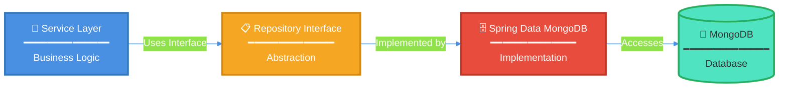
```mermaid
%%{init: {'theme':'base', 'themeVariables': { 'primaryColor':'#4A90E2','primaryTextColor':'#fff','primaryBorderColor':'#357ABD','lineColor':'#4A90E2'}}}%%
graph LR
    Service["💼 Service Layer<br/>━━━━━━━━━━━━━━<br/>Business Logic"]
    Repository["📋 Repository Interface<br/>━━━━━━━━━━━━━━<br/>Abstraction"]
    MongoRepository["🗄️ Spring Data MongoDB<br/>━━━━━━━━━━━━━━<br/>Implementation"]
    MongoDB[("💾 MongoDB<br/>━━━━━━━━━━━━━━<br/>Database")]
    
    Service -->|"Uses Interface"| Repository
    Repository -->|"Implemented by"| MongoRepository
    MongoRepository -->|"Accesses"| MongoDB
    
    classDef serviceStyle fill:#4A90E2,stroke:#357ABD,stroke-width:3px,color:#fff
    classDef interfaceStyle fill:#F5A623,stroke:#D68910,stroke-width:3px,color:#fff
    classDef implStyle fill:#E74C3C,stroke:#C0392B,stroke-width:3px,color:#fff
    classDef dbStyle fill:#50E3C2,stroke:#27AE60,stroke-width:3px,color:#333
    
    class Service serviceStyle
    class Repository interfaceStyle
    class MongoRepository implStyle
    class MongoDB dbStyle
```

### 2. DTO Pattern

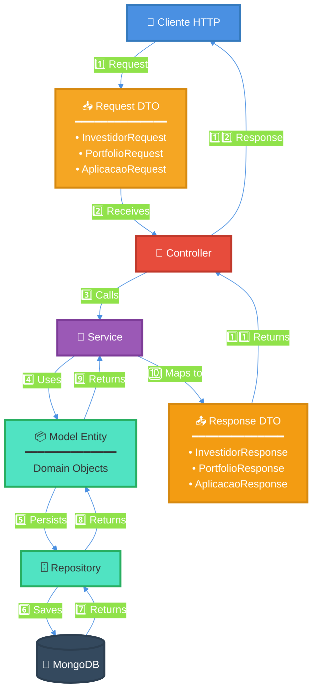
```mermaid
%%{init: {'theme':'base', 'themeVariables': { 'primaryColor':'#4A90E2','primaryTextColor':'#fff','primaryBorderColor':'#357ABD','lineColor':'#4A90E2'}}}%%
graph TB
    Client["👤 Cliente HTTP"]
    RequestDTO["📥 Request DTO<br/>━━━━━━━━━━━━━━<br/>• InvestidorRequest<br/>• PortfolioRequest<br/>• AplicacaoRequest"]
    Controller["📡 Controller"]
    Service["💼 Service"]
    Model["📦 Model Entity<br/>━━━━━━━━━━━━━━<br/>Domain Objects"]
    Repository["🗄️ Repository"]
    MongoDB[("💾 MongoDB")]
    ResponseDTO["📤 Response DTO<br/>━━━━━━━━━━━━━━<br/>• InvestidorResponse<br/>• PortfolioResponse<br/>• AplicacaoResponse"]
    
    Client -->|"1️⃣ Request"| RequestDTO
    RequestDTO -->|"2️⃣ Receives"| Controller
    Controller -->|"3️⃣ Calls"| Service
    Service -->|"4️⃣ Uses"| Model
    Model -->|"5️⃣ Persists"| Repository
    Repository -->|"6️⃣ Saves"| MongoDB
    MongoDB -->|"7️⃣ Returns"| Repository
    Repository -->|"8️⃣ Returns"| Model
    Model -->|"9️⃣ Returns"| Service
    Service -->|"🔟 Maps to"| ResponseDTO
    ResponseDTO -->|"1️⃣1️⃣ Returns"| Controller
    Controller -->|"1️⃣2️⃣ Response"| Client
    
    classDef clientStyle fill:#4A90E2,stroke:#357ABD,stroke-width:3px,color:#fff
    classDef requestStyle fill:#F5A623,stroke:#D68910,stroke-width:3px,color:#fff
    classDef controllerStyle fill:#E74C3C,stroke:#C0392B,stroke-width:3px,color:#fff
    classDef serviceStyle fill:#9B59B6,stroke:#7D3C98,stroke-width:3px,color:#fff
    classDef modelStyle fill:#50E3C2,stroke:#27AE60,stroke-width:3px,color:#333
    classDef responseStyle fill:#F39C12,stroke:#D68910,stroke-width:3px,color:#fff
    classDef dbStyle fill:#34495E,stroke:#2C3E50,stroke-width:3px,color:#fff
    
    class Client clientStyle
    class RequestDTO requestStyle
    class Controller controllerStyle
    class Service serviceStyle
    class Model modelStyle
    class Repository modelStyle
    class ResponseDTO responseStyle
    class MongoDB dbStyle
```

### 3. Dependency Injection

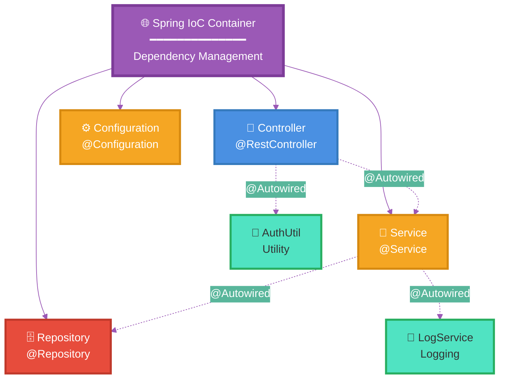
```mermaid
%%{init: {'theme':'base', 'themeVariables': { 'primaryColor':'#9B59B6','primaryTextColor':'#fff','primaryBorderColor':'#7D3C98','lineColor':'#9B59B6'}}}%%
graph TB
    SpringContainer["🌐 Spring IoC Container<br/>━━━━━━━━━━━━━━<br/>Dependency Management"]
    
    SpringContainer --> Controller["📡 Controller<br/>@RestController"]
    SpringContainer --> Service["💼 Service<br/>@Service"]
    SpringContainer --> Repository["🗄️ Repository<br/>@Repository"]
    SpringContainer --> Config["⚙️ Configuration<br/>@Configuration"]
    
    Controller -.->|"@Autowired"| Service
    Service -.->|"@Autowired"| Repository
    Controller -.->|"@Autowired"| AuthUtil["🔐 AuthUtil<br/>Utility"]
    Service -.->|"@Autowired"| LogService["📝 LogService<br/>Logging"]
    
    classDef containerStyle fill:#9B59B6,stroke:#7D3C98,stroke-width:4px,color:#fff
    classDef controllerStyle fill:#4A90E2,stroke:#357ABD,stroke-width:3px,color:#fff
    classDef serviceStyle fill:#F5A623,stroke:#D68910,stroke-width:3px,color:#fff
    classDef repositoryStyle fill:#E74C3C,stroke:#C0392B,stroke-width:3px,color:#fff
    classDef utilStyle fill:#50E3C2,stroke:#27AE60,stroke-width:3px,color:#333
    
    class SpringContainer containerStyle
    class Controller controllerStyle
    class Service serviceStyle
    class Repository repositoryStyle
    class Config serviceStyle
    class AuthUtil utilStyle
    class LogService utilStyle
```

### 4. Aspect-Oriented Programming (AOP)

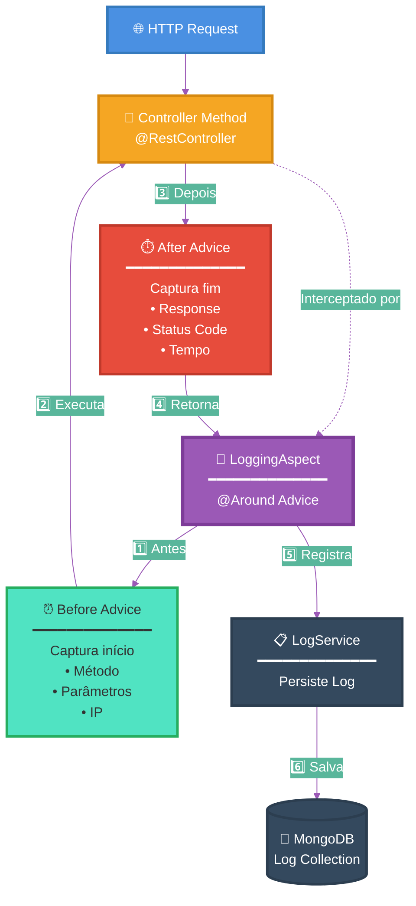
```mermaid
%%{init: {'theme':'base', 'themeVariables': { 'primaryColor':'#9B59B6','primaryTextColor':'#fff','primaryBorderColor':'#7D3C98','lineColor':'#9B59B6'}}}%%
graph TB
    Request["🌐 HTTP Request"]
    Controller["📡 Controller Method<br/>@RestController"]
    Aspect["📝 LoggingAspect<br/>━━━━━━━━━━━━━━<br/>@Around Advice"]
    BeforeAdvice["⏰ Before Advice<br/>━━━━━━━━━━━━━━<br/>Captura início<br/>• Método<br/>• Parâmetros<br/>• IP"]
    AfterAdvice["⏱️ After Advice<br/>━━━━━━━━━━━━━━<br/>Captura fim<br/>• Response<br/>• Status Code<br/>• Tempo"]
    LogService["📋 LogService<br/>━━━━━━━━━━━━━━<br/>Persiste Log"]
    MongoDB[("💾 MongoDB<br/>Log Collection")]
    
    Request --> Controller
    Controller -.->|"Interceptado por"| Aspect
    Aspect -->|"1️⃣ Antes"| BeforeAdvice
    BeforeAdvice -->|"2️⃣ Executa"| Controller
    Controller -->|"3️⃣ Depois"| AfterAdvice
    AfterAdvice -->|"4️⃣ Retorna"| Aspect
    Aspect -->|"5️⃣ Registra"| LogService
    LogService -->|"6️⃣ Salva"| MongoDB
    
    classDef requestStyle fill:#4A90E2,stroke:#357ABD,stroke-width:3px,color:#fff
    classDef controllerStyle fill:#F5A623,stroke:#D68910,stroke-width:3px,color:#fff
    classDef aspectStyle fill:#9B59B6,stroke:#7D3C98,stroke-width:4px,color:#fff
    classDef beforeStyle fill:#50E3C2,stroke:#27AE60,stroke-width:3px,color:#333
    classDef afterStyle fill:#E74C3C,stroke:#C0392B,stroke-width:3px,color:#fff
    classDef logStyle fill:#34495E,stroke:#2C3E50,stroke-width:3px,color:#fff
    
    class Request requestStyle
    class Controller controllerStyle
    class Aspect aspectStyle
    class BeforeAdvice beforeStyle
    class AfterAdvice afterStyle
    class LogService logStyle
    class MongoDB logStyle
```

---

## 📊 Resumo da Arquitetura

### Camadas e Responsabilidades

| Camada | Responsabilidade | Tecnologias |
|--------|------------------|-------------|
| **Frontend - UI** | Interface do usuário | Angular, HTML, CSS, TypeScript |
| **Frontend - Services** | Comunicação HTTP | Angular HTTP Client, RxJS |
| **Frontend - Guards** | Proteção de rotas | Angular Guards |
| **Frontend - Interceptors** | Interceptação de requisições | Angular Interceptors |
| **Backend - Controllers** | Endpoints REST | Spring MVC, Swagger |
| **Backend - Services** | Lógica de negócio | Spring Services |
| **Backend - Repositories** | Acesso a dados | Spring Data MongoDB |
| **Backend - Models** | Entidades de domínio | MongoDB Documents |
| **Security - JWT Filter** | Autenticação | Spring Security, JWT |
| **Cross-Cutting - AOP** | Logging automático | Spring AOP |
| **Cross-Cutting - Exception Handler** | Tratamento de erros | Spring @ControllerAdvice |
| **Database** | Persistência | MongoDB |

### Fluxo de Dados Resumido

```mermaid
%%{init: {'theme':'base', 'themeVariables': { 'primaryColor':'#4A90E2','primaryTextColor':'#fff','primaryBorderColor':'#357ABD','lineColor':'#4A90E2'}}}%%
flowchart LR
    A["👤 Cliente"]
    B["📡 Controller"]
    C["📋 DTO"]
    D["💼 Service"]
    E["✅ Business Rules"]
    F["🗄️ Repository"]
    G[("💾 MongoDB")]
    
    A -->|"1️⃣ Request"| B
    B -->|"2️⃣ Valida"| C
    C -->|"3️⃣ Chama"| D
    D -->|"4️⃣ Valida Negócio"| E
    E -->|"5️⃣ Usa"| F
    F -->|"6️⃣ Query"| G
    G -->|"7️⃣ Retorna"| F
    F -->|"8️⃣ Entidade"| D
    D -->|"9️⃣ Mapeia"| C
    C -->|"🔟 Response"| B
    B -->|"1️⃣1️⃣ HTTP Response"| A
    
    classDef clientStyle fill:#4A90E2,stroke:#357ABD,stroke-width:3px,color:#fff
    classDef controllerStyle fill:#F5A623,stroke:#D68910,stroke-width:3px,color:#fff
    classDef dtoStyle fill:#50E3C2,stroke:#27AE60,stroke-width:3px,color:#333
    classDef serviceStyle fill:#9B59B6,stroke:#7D3C98,stroke-width:3px,color:#fff
    classDef repositoryStyle fill:#E74C3C,stroke:#C0392B,stroke-width:3px,color:#fff
    classDef dbStyle fill:#34495E,stroke:#2C3E50,stroke-width:3px,color:#fff
    
    class A clientStyle
    class B controllerStyle
    class C dtoStyle
    class D serviceStyle
    class E serviceStyle
    class F repositoryStyle
    class G dbStyle
```

---

## 🔍 Pontos de Interceptação

### Onde Acontecem as Interceptações

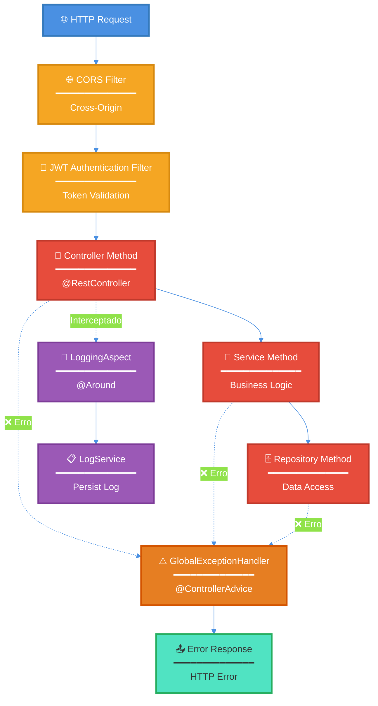
```mermaid
%%{init: {'theme':'base', 'themeVariables': { 'primaryColor':'#4A90E2','primaryTextColor':'#fff','primaryBorderColor':'#357ABD','lineColor':'#4A90E2'}}}%%
graph TB
    Request["🌐 HTTP Request"]
    Filter1["🌐 CORS Filter<br/>━━━━━━━━━━━━━━<br/>Cross-Origin"]
    Filter2["🔑 JWT Authentication Filter<br/>━━━━━━━━━━━━━━<br/>Token Validation"]
    Filter3["📡 Controller Method<br/>━━━━━━━━━━━━━━<br/>@RestController"]
    AOP["📝 LoggingAspect<br/>━━━━━━━━━━━━━━<br/>@Around"]
    Service["💼 Service Method<br/>━━━━━━━━━━━━━━<br/>Business Logic"]
    Repository["🗄️ Repository Method<br/>━━━━━━━━━━━━━━<br/>Data Access"]
    LogService["📋 LogService<br/>━━━━━━━━━━━━━━<br/>Persist Log"]
    ExceptionHandler["⚠️ GlobalExceptionHandler<br/>━━━━━━━━━━━━━━<br/>@ControllerAdvice"]
    ErrorResponse["📤 Error Response<br/>━━━━━━━━━━━━━━<br/>HTTP Error"]
    
    Request --> Filter1
    Filter1 --> Filter2
    Filter2 --> Filter3
    Filter3 -.->|"Interceptado"| AOP
    Filter3 --> Service
    Service --> Repository
    
    AOP --> LogService
    
    Filter3 -.->|"❌ Erro"| ExceptionHandler
    Service -.->|"❌ Erro"| ExceptionHandler
    Repository -.->|"❌ Erro"| ExceptionHandler
    
    ExceptionHandler --> ErrorResponse
    
    classDef requestStyle fill:#4A90E2,stroke:#357ABD,stroke-width:3px,color:#fff
    classDef filterStyle fill:#F5A623,stroke:#D68910,stroke-width:3px,color:#fff
    classDef controllerStyle fill:#E74C3C,stroke:#C0392B,stroke-width:3px,color:#fff
    classDef aopStyle fill:#9B59B6,stroke:#7D3C98,stroke-width:3px,color:#fff
    classDef exceptionStyle fill:#E67E22,stroke:#D35400,stroke-width:3px,color:#fff
    classDef responseStyle fill:#50E3C2,stroke:#27AE60,stroke-width:3px,color:#333
    
    class Request requestStyle
    class Filter1,Filter2 filterStyle
    class Filter3,Service,Repository controllerStyle
    class AOP,LogService aopStyle
    class ExceptionHandler exceptionStyle
    class ErrorResponse responseStyle
```

---

## ✅ Benefícios da Arquitetura

### Vantagens da Separação em Camadas

1. **Manutenibilidade**: Fácil localizar e corrigir bugs
2. **Testabilidade**: Cada camada pode ser testada isoladamente
3. **Escalabilidade**: Fácil adicionar novas funcionalidades
4. **Reutilização**: Services e Repositories podem ser reutilizados
5. **Segurança**: Validação em múltiplas camadas
6. **Performance**: Cache e otimizações por camada
7. **Documentação**: Código auto-documentado pela estrutura

---

**Versão do Documento**: 1.0.0  
**Última Atualização**: Janeiro 2025  
**Autor**: Equipe BartoFinance

