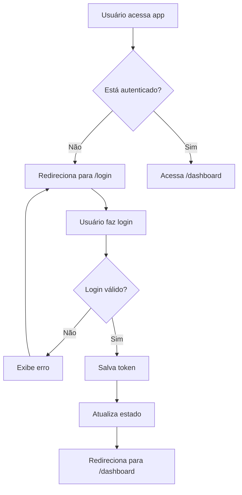
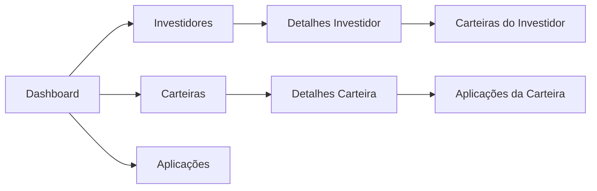

# 📊 Documentação Completa do Frontend - BartoFinance

## 📋 Índice

1. [Visão Geral](#visão-geral)
2. [Arquitetura e Tecnologias](#arquitetura-e-tecnologias)
3. [Estrutura do Projeto](#estrutura-do-projeto)
4. [Configuração e Setup](#configuração-e-setup)
5. [Sistema de Autenticação](#sistema-de-autenticação)
6. [Integração com API Backend](#integração-com-api-backend)
7. [Componentes e Features](#componentes-e-features)
8. [Serviços e Lógica de Negócio](#serviços-e-lógica-de-negócio)
9. [Sistema de Temas](#sistema-de-temas)
10. [Integração com APIs Externas](#integração-com-apis-externas)
11. [Sistema de Notificações](#sistema-de-notificações)
12. [Chatbot com IA](#chatbot-com-ia)
13. [Fluxos de Navegação](#fluxos-de-navegação)
14. [Deploy e Build](#deploy-e-build)
15. [Conclusão](#conclusão)

---

## 🎯 Visão Geral

O **BartoFinance Frontend** é uma aplicação web moderna desenvolvida em **Angular 17** com arquitetura standalone components. O sistema oferece uma interface completa para assessores financeiros gerenciarem seus clientes, carteiras de investimento e obterem insights através de inteligência artificial.

### 🎯 Principais Funcionalidades

- **🔐 Autenticação JWT**: Sistema seguro de login e registro
- **👥 Gestão de Investidores**: CRUD completo de clientes
- **💼 Carteiras de Investimento**: Criação e gestão de portfolios
- **💰 Aplicações Financeiras**: Registro de investimentos
- **🤖 Chatbot IA**: Assistente virtual integrado
- **📊 Dashboard**: Visão geral com estatísticas e cotações
- **🌙 Dark Mode**: Tema claro/escuro responsivo
- **📱 Design Responsivo**: Interface adaptável a todos os dispositivos

---

## 🏗️ Arquitetura e Tecnologias

### 📦 Stack Tecnológico Principal

```json
{
  "framework": "Angular 17.3.0",
  "language": "TypeScript 5.4.2",
  "styling": "Tailwind CSS 3.4.1",
  "http": "Axios 1.12.2",
  "charts": "ApexCharts 3.45.0",
  "icons": "Font Awesome",
  "build": "Angular CLI 17.3.0"
}
```

### 📋 Dependências Principais

```json
{
  "dependencies": {
    "@angular/animations": "^17.3.0",
    "@angular/common": "^17.3.0",
    "@angular/core": "^17.3.0",
    "@angular/forms": "^17.3.0",
    "@angular/router": "^17.3.0",
    "apexcharts": "^3.45.0",
    "axios": "^1.12.2",
    "ng-apexcharts": "^1.7.0",
    "rxjs": "~7.8.0"
  },
  "devDependencies": {
    "tailwindcss": "^3.4.1",
    "autoprefixer": "^10.4.18",
    "postcss": "^8.4.35"
  }
}
```

### 🎨 Características da Arquitetura

- **Standalone Components**: Componentes independentes sem NgModules
- **Signals**: Sistema reativo moderno do Angular
- **Lazy Loading**: Carregamento sob demanda de rotas
- **Reactive Forms**: Formulários reativos com validação
- **HTTP Interceptors**: Interceptação automática de requisições
- **Guards**: Proteção de rotas com autenticação
- **Services**: Lógica de negócio centralizada

---

## 📁 Estrutura do Projeto

```
bartofinance-frontend/
├── src/
│   ├── app/
│   │   ├── core/                    # Funcionalidades centrais
│   │   │   ├── guards/             # Proteção de rotas
│   │   │   ├── interceptors/       # Interceptadores HTTP
│   │   │   ├── models/             # Interfaces e tipos
│   │   │   └── services/           # Serviços principais
│   │   ├── features/               # Módulos de funcionalidades
│   │   │   ├── auth/               # Autenticação
│   │   │   ├── dashboard/          # Painel principal
│   │   │   ├── investidores/       # Gestão de investidores
│   │   │   └── carteiras/          # Gestão de carteiras
│   │   ├── shared/                 # Componentes compartilhados
│   │   │   ├── components/         # Componentes reutilizáveis
│   │   │   └── directives/         # Diretivas customizadas
│   │   ├── app.component.ts        # Componente raiz
│   │   └── app.routes.ts           # Configuração de rotas
│   ├── assets/                     # Recursos estáticos
│   ├── environments/               # Configurações de ambiente
│   └── styles.scss                 # Estilos globais
├── angular.json                    # Configuração do Angular
├── tailwind.config.js              # Configuração do Tailwind
└── package.json                    # Dependências do projeto
```

### 🔧 Configuração do Angular (angular.json)

```json
{
  "projects": {
    "bartofinance-frontend": {
      "projectType": "application",
      "schematics": {
        "@schematics/angular:component": {
          "style": "scss",
          "standalone": true
        }
      },
      "architect": {
        "build": {
          "builder": "@angular-devkit/build-angular:application",
          "options": {
            "outputPath": "dist/bartofinance-frontend",
            "tsConfig": "tsconfig.app.json",
            "inlineStyleLanguage": "scss",
            "styles": ["src/styles.scss"]
          }
        }
      }
    }
  }
}
```

### 🎨 Configuração do Tailwind CSS

```javascript
module.exports = {
  darkMode: 'class', // Habilita dark mode via classe
  content: ["./src/**/*.{html,ts}"],
  theme: {
    extend: {
      colors: {
        primary: {
          50: '#f0f9ff',
          100: '#e0f2fe',
          // ... paleta completa de azuis
          900: '#0c4a6e',
        }
      },
      fontFamily: {
        sans: ['Inter', 'system-ui', 'sans-serif'],
      },
      animation: {
        'fade-in': 'fadeIn 0.5s ease-in-out',
        'slide-up': 'slideUp 0.3s ease-out',
      }
    }
  }
}
```

---

## ⚙️ Configuração e Setup

### 🌍 Configuração de Ambiente

```typescript
// src/environments/environment.ts
export const environment = {
  production: false,
  apiUrl: 'http://localhost:8080',
  brapiApiKey: 'mJeXMvgNvQzTF9CPSTrSLU'
};
```

### 🚀 Scripts de Desenvolvimento

```json
{
  "scripts": {
    "ng": "ng",
    "start": "ng serve --open",
    "build": "ng build",
    "watch": "ng build --watch --configuration development",
    "test": "ng test"
  }
}
```

### 📦 Instalação e Execução

```bash
# Instalar dependências
npm install

# Executar em desenvolvimento
npm start

# Build para produção
npm run build

# Executar testes
npm test
```

---

## 🔐 Sistema de Autenticação

### 🛡️ AuthService - Gerenciamento de Autenticação

```typescript
@Injectable({
  providedIn: 'root'
})
export class AuthService {
  private readonly TOKEN_KEY = 'bartofinance_token';
  private readonly USER_KEY = 'bartofinance_user';
  
  // Signals para reatividade
  isAuthenticated = signal<boolean>(this.hasToken());
  currentUser = signal<UserToken | null>(this.getUserData());

  constructor(
    private http: HttpClient,
    private router: Router
  ) {}

  login(credentials: LoginRequest): Observable<AuthResponse> {
    return this.http.post<AuthResponse>(`${environment.apiUrl}/auth/login`, credentials)
      .pipe(
        tap(response => {
          if (response.sucesso && response.data?.token) {
            this.setToken(response.data.token);
            this.setUserData(response.data);
            this.isAuthenticated.set(true);
            this.currentUser.set(response.data);
          }
        })
      );
  }

  logout(): void {
    localStorage.removeItem(this.TOKEN_KEY);
    localStorage.removeItem(this.USER_KEY);
    this.isAuthenticated.set(false);
    this.currentUser.set(null);
    this.router.navigate(['/login']);
  }
}
```

**Funcionalidade**: Gerencia autenticação JWT com signals reativos, persistência no localStorage e navegação automática.

### 🔒 AuthGuard - Proteção de Rotas

```typescript
export const authGuard: CanActivateFn = () => {
  const authService = inject(AuthService);
  const router = inject(Router);

  const isAuth = authService.isAuthenticated();
  const hasToken = authService.getToken();

  if (isAuth && hasToken) {
    return true;
  }

  router.navigate(['/login']);
  return false;
};
```

**Funcionalidade**: Protege rotas que requerem autenticação, redirecionando usuários não autenticados para login.

### 🔗 AuthInterceptor - Interceptação de Requisições

```typescript
export const authInterceptor: HttpInterceptorFn = (req, next) => {
  const authService = inject(AuthService);
  const token = authService.getToken();

  if (token) {
    const cloned = req.clone({
      headers: req.headers.set('Authorization', `Bearer ${token}`)
    });
    return next(cloned);
  }

  return next(req);
};
```

**Funcionalidade**: Adiciona automaticamente o token JWT em todas as requisições HTTP para o backend.

### 📝 Componente de Login

```typescript
@Component({
  selector: 'app-login',
  standalone: true,
  imports: [CommonModule, ReactiveFormsModule, RouterLink],
  templateUrl: './login.component.html'
})
export class LoginComponent {
  loginForm: FormGroup;
  loading = signal(false);

  constructor(
    private fb: FormBuilder,
    private authService: AuthService,
    private toastService: ToastService,
    private router: Router
  ) {
    this.loginForm = this.fb.group({
      email: ['', [Validators.required, Validators.email]],
      senha: ['', [Validators.required, Validators.minLength(6)]]
    });
  }

  onSubmit(): void {
    if (this.loginForm.valid) {
      this.loading.set(true);

      this.authService.login(this.loginForm.value).subscribe({
        next: (response) => {
          this.toastService.success('Login realizado com sucesso! 🎉');
          this.loading.set(false);
          setTimeout(() => {
            this.router.navigate(['/dashboard']);
          }, 100);
        },
        error: (error) => {
          this.loading.set(false);
          const errorMsg = error.error?.mensagem || 'Credenciais inválidas.';
          this.toastService.error(errorMsg);
        }
      });
    }
  }
}
```

**Funcionalidade**: Formulário de login com validação reativa, feedback visual e navegação automática após sucesso.

---

## 🔌 Integração com API Backend

### 🌐 Configuração de Rotas

```typescript
// src/app/app.routes.ts
export const routes: Routes = [
  {
    path: '',
    redirectTo: '/dashboard',
    pathMatch: 'full'
  },
  {
    path: 'login',
    canActivate: [guestGuard],
    loadComponent: () => import('./features/auth/login/login.component')
      .then(m => m.LoginComponent)
  },
  {
    path: 'dashboard',
    canActivate: [authGuard],
    loadComponent: () => import('./features/dashboard/dashboard.component')
      .then(m => m.DashboardComponent)
  },
  {
    path: 'investidores',
    canActivate: [authGuard],
    loadComponent: () => import('./features/investidores/investidores-list/investidores-list.component')
      .then(m => m.InvestidoresListComponent)
  }
];
```

**Funcionalidade**: Configuração de rotas com lazy loading e proteção por guards.

### 📊 Modelos de Dados

```typescript
// src/app/core/models/auth.model.ts
export interface LoginRequest {
  email: string;
  senha: string;
}

export interface RegisterRequest {
  nome: string;
  email: string;
  senha: string;
}

export interface UserToken {
  token: string;
  tipo: string;
  assessorId: string;
  nome: string;
  email: string;
  mensagem?: string;
}

export interface ApiResponse<T> {
  sucesso: boolean;
  mensagem: string;
  data: T;
  timestamp?: string;
}

export type AuthResponse = ApiResponse<UserToken>;
```

**Funcionalidade**: Interfaces TypeScript que garantem type safety na comunicação com a API.

### 👥 InvestidorService - CRUD de Investidores

```typescript
@Injectable({
  providedIn: 'root'
})
export class InvestidorService {
  private readonly API_URL = `${environment.apiUrl}/investors`;

  constructor(private http: HttpClient) {}

  listarInvestidores(perfilInvestidor?: string): Observable<ApiResponse<InvestidorResponse[]>> {
    let params = new HttpParams();
    if (perfilInvestidor) {
      params = params.set('perfilInvestidor', perfilInvestidor);
    }
    return this.http.get<ApiResponse<InvestidorResponse[]>>(this.API_URL, { params });
  }

  criarInvestidor(request: InvestidorRequest): Observable<ApiResponse<InvestidorResponse>> {
    return this.http.post<ApiResponse<InvestidorResponse>>(this.API_URL, request);
  }

  atualizarInvestidor(id: string, request: InvestidorRequest): Observable<ApiResponse<InvestidorResponse>> {
    return this.http.put<ApiResponse<InvestidorResponse>>(`${this.API_URL}/${id}`, request);
  }

  deletarInvestidor(id: string): Observable<ApiResponse<void>> {
    return this.http.delete<ApiResponse<void>>(`${this.API_URL}/${id}`);
  }
}
```

**Funcionalidade**: Serviço completo para operações CRUD de investidores com parâmetros de filtro.

### 💼 PortfolioService - Gestão de Carteiras

```typescript
@Injectable({
  providedIn: 'root'
})
export class PortfolioService {
  private readonly API_URL = `${environment.apiUrl}/portfolios`;

  constructor(private http: HttpClient) {}

  listarPortfolios(): Observable<ApiResponse<PortfolioResponse[]>> {
    return this.http.get<ApiResponse<PortfolioResponse[]>>(this.API_URL);
  }

  criarPortfolio(request: PortfolioRequest): Observable<ApiResponse<PortfolioResponse>> {
    return this.http.post<ApiResponse<PortfolioResponse>>(this.API_URL, request);
  }

  simularPortfolio(request: PortfolioRequest): Observable<ApiResponse<PortfolioResponse>> {
    return this.http.post<ApiResponse<PortfolioResponse>>(`${this.API_URL}/simulate`, request);
  }
}
```

**Funcionalidade**: Serviço para gestão de carteiras incluindo simulação de portfolios.

---

## 🧩 Componentes e Features

### 🏠 DashboardComponent - Painel Principal

```typescript
@Component({
  selector: 'app-dashboard',
  standalone: true,
  imports: [CommonModule, RouterLink, FooterComponent],
  templateUrl: './dashboard.component.html'
})
export class DashboardComponent implements OnInit, OnDestroy {
  userName = signal('');
  loading = signal(true);
  stats = signal({
    investidores: 0,
    carteiras: 0,
    aplicacoes: 0,
    valorTotal: 0
  });

  // Cotações da Brapi
  marketQuotes = signal<BrapiQuote[]>([]);
  topStocks = signal<BrapiQuote[]>([]);
  currencies = signal<BrapiQuote[]>([]);
  internationalIndices = signal<BrapiQuote[]>([]);
  loadingQuotes = signal(true);

  constructor(
    private authService: AuthService,
    private investidorService: InvestidorService,
    private portfolioService: PortfolioService,
    private aplicacaoService: AplicacaoService,
    public brapiService: BrapiService
  ) {}

  ngOnInit(): void {
    const user = this.authService.currentUser();
    if (user) {
      this.userName.set(user.nome);
    }
    this.carregarDashboard();
    this.carregarCotacoes();
    
    // Atualizar cotações a cada 1 minuto
    this.quotesSubscription = interval(60000).subscribe(() => {
      this.carregarCotacoes();
    });
  }

  carregarDashboard(): void {
    this.loading.set(true);
    
    forkJoin({
      investidores: this.investidorService.listarInvestidores(),
      carteiras: this.portfolioService.listarPortfolios(),
      aplicacoes: this.aplicacaoService.listarAplicacoes()
    }).subscribe({
      next: (response) => {
        const investidores = response.investidores.data || [];
        const carteiras = response.carteiras.data || [];
        const aplicacoes = response.aplicacoes.data || [];
        
        const valorTotal = carteiras.reduce((sum, cart) => {
          return sum + (cart.valorTotal || 0);
        }, 0);
        
        this.stats.set({
          investidores: investidores.length,
          carteiras: carteiras.length,
          aplicacoes: aplicacoes.length,
          valorTotal: valorTotal
        });
        
        this.loading.set(false);
      }
    });
  }
}
```

**Funcionalidade**: Dashboard principal que exibe estatísticas consolidadas e cotações em tempo real.

### 👥 InvestidoresListComponent - Gestão de Investidores

```typescript
@Component({
  selector: 'app-investidores-list',
  standalone: true,
  imports: [CommonModule, RouterLink, ReactiveFormsModule, ConfirmModalComponent],
  templateUrl: './investidores-list.component.html'
})
export class InvestidoresListComponent implements OnInit {
  investidores = signal<InvestidorResponse[]>([]);
  todosInvestidores = signal<InvestidorResponse[]>([]);
  loading = signal(false);
  showModal = signal(false);
  isEditing = signal(false);
  currentInvestidorId = signal<string | null>(null);
  investidorForm: FormGroup;
  filtroPerfil = signal<PerfilInvestidor | ''>('');

  constructor(
    private investidorService: InvestidorService,
    private toastService: ToastService,
    private authService: AuthService,
    private fb: FormBuilder
  ) {
    this.investidorForm = this.fb.group({
      nome: ['', [Validators.required, Validators.minLength(3)]],
      cpf: ['', [Validators.required, Validators.pattern(/^\d{11}$/)]],
      email: ['', [Validators.email]],
      telefone: ['', [Validators.pattern(/^\d{10,11}$/)]],
      perfilInvestidor: ['', [Validators.required]],
      patrimonioAtual: [0, [Validators.required, Validators.min(0)]],
      rendaMensal: [0, [Validators.required, Validators.min(0)]],
      objetivos: ['', [Validators.maxLength(500)]]
    });
  }

  carregarInvestidores(): void {
    this.loading.set(true);
    
    this.investidorService.listarInvestidores().subscribe({
      next: (response) => {
        if (response.sucesso && response.data) {
          this.todosInvestidores.set(response.data);
          
          // Aplica filtro localmente
          const perfil = this.filtroPerfil();
          if (perfil) {
            this.investidores.set(response.data.filter(inv => inv.perfilInvestidor === perfil));
          } else {
            this.investidores.set(response.data);
          }
        }
        this.loading.set(false);
      }
    });
  }

  salvarInvestidor(): void {
    if (this.investidorForm.invalid) {
      this.toastService.warning('Por favor, preencha todos os campos obrigatórios');
      return;
    }

    this.loading.set(true);
    const request: InvestidorRequest = this.investidorForm.value;

    const operacao = this.isEditing()
      ? this.investidorService.atualizarInvestidor(this.currentInvestidorId()!, request)
      : this.investidorService.criarInvestidor(request);

    operacao.subscribe({
      next: (response) => {
        this.loading.set(false);
        this.toastService.success(
          this.isEditing() ? 'Investidor atualizado!' : 'Investidor criado!'
        );
        this.fecharModal();
        this.carregarInvestidores();
      }
    });
  }
}
```

**Funcionalidade**: Componente completo para CRUD de investidores com filtros, validação e modais de confirmação.

### 🎨 Componente de Toast - Notificações

```typescript
@Component({
  selector: 'app-toast',
  standalone: true,
  imports: [CommonModule],
  templateUrl: './toast.component.html'
})
export class ToastComponent {
  private toastService = inject(ToastService);
  
  toasts = this.toastService.toasts$;

  getIcon(type: Toast['type']): string {
    const icons = {
      success: '✓',
      error: '✕',
      warning: '⚠',
      info: 'ℹ'
    };
    return icons[type];
  }

  getColorClasses(type: Toast['type']): string {
    const classes = {
      success: 'bg-green-50 border-green-200 text-green-800',
      error: 'bg-red-50 border-red-200 text-red-800',
      warning: 'bg-yellow-50 border-yellow-200 text-yellow-800',
      info: 'bg-blue-50 border-blue-200 text-blue-800'
    };
    return classes[type];
  }

  close(id: string): void {
    this.toastService.remove(id);
  }
}
```

**Funcionalidade**: Sistema de notificações toast com diferentes tipos e estilos visuais.

---

## 🔧 Serviços e Lógica de Negócio

### 🌙 ThemeService - Sistema de Temas

```typescript
@Injectable({
  providedIn: 'root'
})
export class ThemeService {
  private _theme = signal<Theme>(this.getInitialTheme());
  isDark = computed(() => this._theme() === 'dark');

  constructor() {
    this.applyTheme(this._theme());
  }

  private getInitialTheme(): Theme {
    const saved = localStorage.getItem('theme');
    if (saved === 'light' || saved === 'dark') {
      return saved;
    }
    
    // Detecta preferência do sistema
    const prefersDark = window.matchMedia('(prefers-color-scheme: dark)').matches;
    return prefersDark ? 'dark' : 'light';
  }

  toggleTheme(): void {
    const newTheme = this._theme() === 'light' ? 'dark' : 'light';
    this.setTheme(newTheme);
  }

  setTheme(theme: Theme): void {
    this._theme.set(theme);
    localStorage.setItem('theme', theme);
    this.applyTheme(theme);
  }

  private applyTheme(theme: Theme): void {
    const html = document.documentElement;
    
    if (theme === 'dark') {
      html.classList.add('dark');
    } else {
      html.classList.remove('dark');
    }
  }

  watchSystemPreference(): void {
    window.matchMedia('(prefers-color-scheme: dark)').addEventListener('change', (e) => {
      if (!localStorage.getItem('theme')) {
        this.setTheme(e.matches ? 'dark' : 'light');
      }
    });
  }
}
```

**Funcionalidade**: Gerencia temas claro/escuro com detecção automática de preferência do sistema e persistência.

### 🔔 ToastService - Sistema de Notificações

```typescript
@Injectable({
  providedIn: 'root'
})
export class ToastService {
  private toastsSubject = new BehaviorSubject<Toast[]>([]);
  toasts$ = this.toastsSubject.asObservable();

  success(message: string, duration: number = 5000): void {
    this.add({ type: 'success', message, duration });
  }

  error(message: string, duration: number = 7000): void {
    this.add({ type: 'error', message, duration });
  }

  warning(message: string, duration: number = 6000): void {
    this.add({ type: 'warning', message, duration });
  }

  info(message: string, duration: number = 5000): void {
    this.add({ type: 'info', message, duration });
  }

  private add(toast: Omit<Toast, 'id'>): void {
    const id = Date.now().toString();
    const newToast: Toast = { ...toast, id };
    
    this.toastsSubject.next([...this.toastsSubject.value, newToast]);
    
    if (toast.duration > 0) {
      setTimeout(() => this.remove(id), toast.duration);
    }
  }

  remove(id: string): void {
    this.toastsSubject.next(
      this.toastsSubject.value.filter(toast => toast.id !== id)
    );
  }
}
```

**Funcionalidade**: Sistema completo de notificações toast com diferentes tipos e auto-remoção.

---

## 🌐 Integração com APIs Externas

### 📈 BrapiService - Cotações em Tempo Real

```typescript
@Injectable({
  providedIn: 'root'
})
export class BrapiService {
  private readonly API_URL = 'https://brapi.dev/api';
  private readonly API_KEY = environment.brapiApiKey;

  getQuotes(symbols: string[]): Observable<BrapiResponse> {
    console.log('📡 [BRAPI] Buscando:', symbols.join(', '));
    
    // Para o plano free, fazemos uma requisição por ação
    const requests = symbols.map(symbol => {
      const url = `${this.API_URL}/quote/${symbol}?token=${this.API_KEY}`;
      
      return from(axios.get<BrapiResponse>(url))
        .pipe(
          map(response => response.data.results[0]),
          catchError((error: AxiosError) => {
            console.error(`❌ [BRAPI] Erro ao buscar ${symbol}:`, error.response?.status);
            return of(this.getMockData([symbol]).results[0]);
          })
        );
    });
    
    return forkJoin(requests)
      .pipe(
        map((results: BrapiQuote[]) => ({
          results: results.filter(r => r !== null && r !== undefined),
          requestedAt: new Date().toISOString(),
          took: '0ms'
        })),
        catchError(() => of(this.getMockData(symbols)))
      );
  }

  getMainIndices(): Observable<BrapiResponse> {
    return this.getQuotes(['^BVSP', 'USDBRL=X', 'EURBRL=X']);
  }

  getTopStocks(): Observable<BrapiResponse> {
    return this.getQuotes([
      'PETR4', 'VALE3', 'ITUB4', 'BBDC4', 'MGLU3', 'B3SA3'
    ]);
  }

  getTopCurrencies(): Observable<BrapiResponse> {
    return this.getQuotes([
      'USDBRL=X', 'EURBRL=X', 'GBPBRL=X', 'JPYBRL=X',
      'CNYBRL=X', 'CHFBRL=X', 'CADBRL=X', 'AUDBRL=X'
    ]);
  }

  getInternationalIndices(): Observable<BrapiResponse> {
    return this.getQuotes([
      '^GSPC', '^DJI', '^IXIC', '^N225', '^FTSE',
      'BTC-USD', 'ETH-USD', 'GC=F'
    ]);
  }

  formatPrice(price: number, currency: string = 'BRL'): string {
    return new Intl.NumberFormat('pt-BR', {
      style: 'currency',
      currency: currency
    }).format(price);
  }

  formatPercent(percent: number): string {
    const sign = percent >= 0 ? '+' : '';
    return `${sign}${percent.toFixed(2)}%`;
  }

  getVariationClass(change: number): string {
    if (change > 0) return 'text-green-600';
    if (change < 0) return 'text-red-600';
    return 'text-gray-600';
  }

  getVariationIcon(change: number): string {
    if (change > 0) return '📈';
    if (change < 0) return '📉';
    return '➡️';
  }
}
```

**Funcionalidade**: Serviço completo para integração com API Brapi, incluindo fallback com dados mockados e formatação de valores.

### 🤖 AIService - Integração com IA

```typescript
@Injectable({
  providedIn: 'root'
})
export class AIService {
  private apiUrl = `${environment.apiUrl}/ai`;

  constructor(private http: HttpClient) {}

  analisarPerfil(request: AIAnaliseRequest): Observable<ApiResponse<AIAnaliseResponse>> {
    return this.http.post<ApiResponse<AIAnaliseResponse>>(
      `${this.apiUrl}/analisar-perfil`,
      request
    );
  }

  analisarCarteira(request: AIAnaliseRequest): Observable<ApiResponse<AIAnaliseResponse>> {
    return this.http.post<ApiResponse<AIAnaliseResponse>>(
      `${this.apiUrl}/analisar-carteira`,
      request
    );
  }

  sugerirDiversificacao(request: AIAnaliseRequest): Observable<ApiResponse<AIAnaliseResponse>> {
    return this.http.post<ApiResponse<AIAnaliseResponse>>(
      `${this.apiUrl}/sugerir-diversificacao`,
      request
    );
  }

  gerarInsight(request: AIAnaliseRequest): Observable<ApiResponse<AIAnaliseResponse>> {
    return this.http.post<ApiResponse<AIAnaliseResponse>>(
      `${this.apiUrl}/gerar-insight`,
      request
    );
  }
}
```

**Funcionalidade**: Serviço para comunicação com endpoints de IA do backend, incluindo análise de perfis e carteiras.

---

## 🤖 Chatbot com IA

### 💬 AiChatbotComponent - Assistente Virtual

```typescript
@Component({
  selector: 'app-ai-chatbot',
  standalone: true,
  imports: [CommonModule, FormsModule],
  templateUrl: './ai-chatbot.component.html'
})
export class AiChatbotComponent {
  isOpen = signal(false);
  isMinimized = signal(false);
  messages = signal<ChatMessage[]>([]);
  userInput = signal('');
  isLoading = signal(false);

  constructor(
    private aiService: AIService,
    private toastService: ToastService
  ) {
    // Mensagem de boas-vindas
    this.messages.set([{
      role: 'assistant',
      content: 'Olá! Sou o assistente virtual BartoFinance. Estou aqui para ajudar com dúvidas sobre assessoria de investimentos, gestão de carteiras, perfis de investidores e estratégias financeiras. Como posso auxiliá-lo hoje?',
      timestamp: new Date()
    }]);
  }

  sendMessage(): void {
    const userMessage = this.userInput().trim();
    if (!userMessage || this.isLoading()) {
      return;
    }

    // Adiciona mensagem do usuário
    this.messages.update(msgs => [...msgs, {
      role: 'user',
      content: userMessage,
      timestamp: new Date()
    }]);

    this.userInput.set('');
    this.isLoading.set(true);

    // Cria prompt especializado
    const systemPrompt = `Você é um assistente especializado em assessoria de investimentos e gestão financeira para o sistema BartoFinance. 

Seu papel é ajudar assessores de investimento com:
- Orientações sobre perfis de investidores (Conservador, Moderado, Agressivo)
- Sugestões de estratégias de diversificação
- Explicações sobre tipos de produtos financeiros (CDB, Tesouro Direto, Ações, Fundos, Criptomoedas)
- Dicas de gestão de carteiras
- Interpretação de rentabilidade e metas
- Melhores práticas de assessoria financeira
- Funcionalidades do sistema BartoFinance

Sempre responda de forma profissional, clara e objetiva. Use no máximo 150 palavras por resposta.

Pergunta do assessor: ${userMessage}`;

    // Envia para a IA
    this.aiService.gerarInsight({ prompt: systemPrompt }).subscribe({
      next: (response) => {
        if (response.sucesso && response.data?.insight) {
          const insightText = response.data.insight || 'Desculpe, não consegui gerar uma resposta.';
          this.messages.update(msgs => [...msgs, {
            role: 'assistant',
            content: insightText,
            timestamp: new Date()
          }]);
        } else {
          this.messages.update(msgs => [...msgs, {
            role: 'assistant',
            content: '⚠️ Não foi possível gerar uma resposta. Por favor, tente reformular sua pergunta.',
            timestamp: new Date()
          }]);
        }
        this.isLoading.set(false);
        setTimeout(() => this.scrollToBottom(), 100);
      },
      error: (error) => {
        console.error('Erro ao chamar IA:', error);
        this.messages.update(msgs => [...msgs, {
          role: 'assistant',
          content: '⚠️ Desculpe, ocorreu um erro ao processar sua pergunta. Por favor, tente novamente.',
          timestamp: new Date()
        }]);
        this.isLoading.set(false);
        setTimeout(() => this.scrollToBottom(), 100);
      }
    });
  }

  private scrollToBottom(): void {
    const chatMessages = document.querySelector('.chat-messages');
    if (chatMessages) {
      chatMessages.scrollTop = chatMessages.scrollHeight;
    }
  }

  clearChat(): void {
    this.messages.set([{
      role: 'assistant',
      content: 'Conversa limpa. Como posso ajudá-lo?',
      timestamp: new Date()
    }]);
  }

  onKeyPress(event: KeyboardEvent): void {
    if (event.key === 'Enter' && !event.shiftKey) {
      event.preventDefault();
      this.sendMessage();
    }
  }
}
```

**Funcionalidade**: Chatbot completo com interface flutuante, integração com IA, histórico de conversas e comandos de teclado.

---

## 🧭 Fluxos de Navegação

### 🗺️ Estrutura de Rotas

```typescript
// Configuração completa de rotas
export const routes: Routes = [
  // Redirecionamento padrão
  {
    path: '',
    redirectTo: '/dashboard',
    pathMatch: 'full'
  },
  
  // Rotas públicas (apenas para usuários não autenticados)
  {
    path: 'login',
    canActivate: [guestGuard],
    loadComponent: () => import('./features/auth/login/login.component')
      .then(m => m.LoginComponent)
  },
  {
    path: 'register',
    canActivate: [guestGuard],
    loadComponent: () => import('./features/auth/register/register.component')
      .then(m => m.RegisterComponent)
  },
  
  // Rotas protegidas (requerem autenticação)
  {
    path: 'dashboard',
    canActivate: [authGuard],
    loadComponent: () => import('./features/dashboard/dashboard.component')
      .then(m => m.DashboardComponent)
  },
  {
    path: 'investidores',
    canActivate: [authGuard],
    loadComponent: () => import('./features/investidores/investidores-list/investidores-list.component')
      .then(m => m.InvestidoresListComponent)
  },
  {
    path: 'investidores/:id',
    canActivate: [authGuard],
    loadComponent: () => import('./features/investidores/investidor-detail/investidor-detail.component')
      .then(m => m.InvestidorDetailComponent)
  },
  {
    path: 'carteiras',
    canActivate: [authGuard],
    loadComponent: () => import('./features/carteiras/carteiras-list/carteiras-list.component')
      .then(m => m.CarteirasListComponent)
  },
  {
    path: 'carteiras/:id',
    canActivate: [authGuard],
    loadComponent: () => import('./features/carteiras/carteira-detail/carteira-detail.component')
      .then(m => m.CarteiraDetailComponent)
  },
  
  // Rota catch-all (404)
  {
    path: '**',
    redirectTo: '/dashboard'
  }
];
```

### 🔄 Fluxo de Autenticação



### 🧭 Navegação entre Features



---

## 🚀 Deploy e Build

### 📦 Configuração de Build

```json
{
  "build": {
    "builder": "@angular-devkit/build-angular:application",
    "options": {
      "outputPath": "dist/bartofinance-frontend",
      "index": "src/index.html",
      "browser": "src/main.ts",
      "polyfills": ["zone.js"],
      "tsConfig": "tsconfig.app.json",
      "inlineStyleLanguage": "scss",
      "assets": [
        "src/favicon.ico",
        "src/assets"
      ],
      "styles": ["src/styles.scss"],
      "scripts": []
    },
    "configurations": {
      "production": {
        "budgets": [
          {
            "type": "initial",
            "maximumWarning": "500kb",
            "maximumError": "1mb"
          }
        ],
        "outputHashing": "all"
      }
    }
  }
}
```

### 🔧 Scripts de Build

```bash
# Desenvolvimento
npm start
# ou
ng serve --open

# Build de desenvolvimento
npm run build
# ou
ng build

# Build de produção
ng build --configuration production

# Build com watch mode
npm run watch
# ou
ng build --watch --configuration development
```

### 🌐 Deploy em Produção

```bash
# 1. Build para produção
ng build --configuration production

# 2. Os arquivos estarão em dist/bartofinance-frontend/
# 3. Servir com qualquer servidor web estático:
#    - Nginx
#    - Apache
#    - Vercel
#    - Netlify
#    - GitHub Pages
```

### 🐳 Docker (Opcional)

```dockerfile
# Dockerfile
FROM node:18-alpine as build

WORKDIR /app
COPY package*.json ./
RUN npm ci --only=production

COPY . .
RUN npm run build --configuration production

FROM nginx:alpine
COPY --from=build /app/dist/bartofinance-frontend /usr/share/nginx/html
COPY nginx.conf /etc/nginx/nginx.conf

EXPOSE 80
CMD ["nginx", "-g", "daemon off;"]
```

---

## 📊 Fluxos de Dados e Estado

### 🔄 Gerenciamento de Estado com Signals

```typescript
// Exemplo de uso de signals no componente
export class InvestidoresListComponent {
  // Signals para estado reativo
  investidores = signal<InvestidorResponse[]>([]);
  loading = signal(false);
  showModal = signal(false);
  filtroPerfil = signal<PerfilInvestidor | ''>('');

  // Computed signals para valores derivados
  investidoresFiltrados = computed(() => {
    const perfil = this.filtroPerfil();
    const todos = this.investidores();
    
    return perfil 
      ? todos.filter(inv => inv.perfilInvestidor === perfil)
      : todos;
  });

  // Métodos que atualizam signals
  aplicarFiltro(perfil: PerfilInvestidor | ''): void {
    this.filtroPerfil.set(perfil);
  }

  carregarInvestidores(): void {
    this.loading.set(true);
    
    this.investidorService.listarInvestidores().subscribe({
      next: (response) => {
        this.investidores.set(response.data || []);
        this.loading.set(false);
      },
      error: (error) => {
        this.loading.set(false);
        this.toastService.error('Erro ao carregar investidores');
      }
    });
  }
}
```

### 🔗 Comunicação entre Componentes

```typescript
// Serviço compartilhado para comunicação
@Injectable({
  providedIn: 'root'
})
export class SharedStateService {
  // Signals compartilhados
  private _selectedInvestidor = signal<InvestidorResponse | null>(null);
  private _refreshTrigger = signal(0);

  // Getters públicos
  selectedInvestidor = this._selectedInvestidor.asReadonly();
  refreshTrigger = this._refreshTrigger.asReadonly();

  // Métodos para atualizar estado
  setSelectedInvestidor(investidor: InvestidorResponse | null): void {
    this._selectedInvestidor.set(investidor);
  }

  triggerRefresh(): void {
    this._refreshTrigger.update(val => val + 1);
  }
}
```

---

## 🎨 Sistema de Design e UI/UX

### 🎨 Paleta de Cores

```scss
// Cores primárias (azul BartoFinance)
$primary-50: #f0f9ff;
$primary-100: #e0f2fe;
$primary-200: #bae6fd;
$primary-300: #7dd3fc;
$primary-400: #38bdf8;
$primary-500: #0ea5e9;
$primary-600: #0284c7;
$primary-700: #0369a1;
$primary-800: #075985;
$primary-900: #0c4a6e;

// Cores semânticas
$success: #10b981;
$warning: #f59e0b;
$error: #ef4444;
$info: #3b82f6;
```

### 🎭 Componentes de UI

```html
<!-- Botão primário -->
<button class="bg-primary-600 hover:bg-primary-700 text-white font-medium py-2 px-4 rounded-lg transition-colors duration-200">
  Salvar
</button>

<!-- Card de investidor -->
<div class="bg-white dark:bg-gray-800 rounded-lg shadow-md p-6 border border-gray-200 dark:border-gray-700">
  <h3 class="text-lg font-semibold text-gray-900 dark:text-white">{{ investidor.nome }}</h3>
  <p class="text-sm text-gray-600 dark:text-gray-400">{{ investidor.email }}</p>
  <span class="inline-flex items-center px-2.5 py-0.5 rounded-full text-xs font-medium bg-primary-100 text-primary-800">
    {{ investidor.perfilInvestidor }}
  </span>
</div>

<!-- Input com validação -->
<div class="space-y-2">
  <label class="block text-sm font-medium text-gray-700 dark:text-gray-300">
    Nome Completo
  </label>
  <input 
    type="text" 
    class="w-full px-3 py-2 border border-gray-300 dark:border-gray-600 rounded-md shadow-sm focus:outline-none focus:ring-primary-500 focus:border-primary-500 dark:bg-gray-700 dark:text-white"
    [class.border-red-500]="nome?.invalid && nome?.touched"
    formControlName="nome"
  >
  <div *ngIf="nome?.invalid && nome?.touched" class="text-sm text-red-600">
    <span *ngIf="nome?.errors?.['required']">Nome é obrigatório</span>
    <span *ngIf="nome?.errors?.['minlength']">Nome deve ter pelo menos 3 caracteres</span>
  </div>
</div>
```

### 🌙 Dark Mode

```scss
// Configuração do dark mode
.dark {
  // Sobrescreve cores para tema escuro
  --bg-primary: #1f2937;
  --bg-secondary: #374151;
  --text-primary: #f9fafb;
  --text-secondary: #d1d5db;
  --border-color: #4b5563;
}

// Classes utilitárias
.bg-white { @apply bg-white dark:bg-gray-800; }
.text-gray-900 { @apply text-gray-900 dark:text-white; }
.border-gray-200 { @apply border-gray-200 dark:border-gray-700; }
```

---

## 🔧 Diretivas Customizadas

### 📱 Máscaras de Input

```typescript
// CPF Mask Directive
@Directive({
  selector: '[appCpfMask]',
  standalone: true
})
export class CpfMaskDirective {
  @HostListener('input', ['$event'])
  onInput(event: any): void {
    let value = event.target.value.replace(/\D/g, '');
    
    if (value.length <= 11) {
      value = value.replace(/(\d{3})(\d{3})(\d{3})(\d{2})/, '$1.$2.$3-$4');
    }
    
    event.target.value = value;
  }
}

// Currency Mask Directive
@Directive({
  selector: '[appCurrencyMask]',
  standalone: true
})
export class CurrencyMaskDirective {
  @HostListener('input', ['$event'])
  onInput(event: any): void {
    let value = event.target.value.replace(/\D/g, '');
    
    if (value) {
      value = (parseInt(value) / 100).toLocaleString('pt-BR', {
        style: 'currency',
        currency: 'BRL'
      });
    }
    
    event.target.value = value;
  }
}
```

### 🎯 Uso das Diretivas

```html
<!-- Input com máscara de CPF -->
<input 
  type="text" 
  appCpfMask
  formControlName="cpf"
  placeholder="000.000.000-00"
>

<!-- Input com máscara de moeda -->
<input 
  type="text" 
  appCurrencyMask
  formControlName="patrimonioAtual"
  placeholder="R$ 0,00"
>
```

---

## 📊 Gráficos e Visualizações

### 📈 Integração com ApexCharts

```typescript
// Componente de gráfico
@Component({
  selector: 'app-chart',
  standalone: true,
  imports: [NgApexchartsModule],
  template: `
    <apx-chart
      [series]="chartOptions.series"
      [chart]="chartOptions.chart"
      [xaxis]="chartOptions.xaxis"
      [yaxis]="chartOptions.yaxis"
      [title]="chartOptions.title"
      [colors]="chartOptions.colors"
    ></apx-chart>
  `
})
export class ChartComponent {
  chartOptions: any = {
    series: [{
      name: 'Rentabilidade',
      data: [10, 15, 12, 18, 20, 25, 22]
    }],
    chart: {
      type: 'line',
      height: 350,
      toolbar: {
        show: true
      }
    },
    xaxis: {
      categories: ['Jan', 'Fev', 'Mar', 'Abr', 'Mai', 'Jun', 'Jul']
    },
    yaxis: {
      title: {
        text: 'Rentabilidade (%)'
      }
    },
    title: {
      text: 'Evolução da Carteira',
      align: 'left'
    },
    colors: ['#0ea5e9']
  };
}
```

---

## 🧪 Testes e Qualidade

### 🔬 Estrutura de Testes

```typescript
// Exemplo de teste de componente
describe('InvestidoresListComponent', () => {
  let component: InvestidoresListComponent;
  let fixture: ComponentFixture<InvestidoresListComponent>;
  let mockInvestidorService: jasmine.SpyObj<InvestidorService>;

  beforeEach(async () => {
    const spy = jasmine.createSpyObj('InvestidorService', [
      'listarInvestidores',
      'criarInvestidor',
      'atualizarInvestidor',
      'deletarInvestidor'
    ]);

    await TestBed.configureTestingModule({
      imports: [InvestidoresListComponent],
      providers: [
        { provide: InvestidorService, useValue: spy }
      ]
    }).compileComponents();

    fixture = TestBed.createComponent(InvestidoresListComponent);
    component = fixture.componentInstance;
    mockInvestidorService = TestBed.inject(InvestidorService) as jasmine.SpyObj<InvestidorService>;
  });

  it('should create', () => {
    expect(component).toBeTruthy();
  });

  it('should load investidores on init', () => {
    const mockData = [
      { id: '1', nome: 'João Silva', cpf: '12345678901', perfilInvestidor: 'MODERADO' }
    ];
    
    mockInvestidorService.listarInvestidores.and.returnValue(
      of({ sucesso: true, data: mockData })
    );

    component.ngOnInit();

    expect(mockInvestidorService.listarInvestidores).toHaveBeenCalled();
    expect(component.investidores()).toEqual(mockData);
  });
});
```

### 🎯 Testes de Serviços

```typescript
describe('AuthService', () => {
  let service: AuthService;
  let httpMock: HttpTestingController;

  beforeEach(() => {
    TestBed.configureTestingModule({
      imports: [HttpClientTestingModule],
      providers: [AuthService]
    });
    
    service = TestBed.inject(AuthService);
    httpMock = TestBed.inject(HttpTestingController);
  });

  it('should login successfully', () => {
    const mockResponse = {
      sucesso: true,
      data: {
        token: 'mock-token',
        assessorId: '123',
        nome: 'João Silva',
        email: 'joao@test.com'
      }
    };

    service.login({ email: 'joao@test.com', senha: '123456' }).subscribe(response => {
      expect(response).toEqual(mockResponse);
      expect(service.isAuthenticated()).toBe(true);
    });

    const req = httpMock.expectOne(`${environment.apiUrl}/auth/login`);
    expect(req.request.method).toBe('POST');
    req.flush(mockResponse);
  });
});
```

---

## 🚀 Performance e Otimizações

### ⚡ Lazy Loading

```typescript
// Carregamento sob demanda de componentes
const routes: Routes = [
  {
    path: 'investidores',
    canActivate: [authGuard],
    loadComponent: () => import('./features/investidores/investidores-list/investidores-list.component')
      .then(m => m.InvestidoresListComponent)
  }
];
```

### 🔄 OnPush Change Detection

```typescript
@Component({
  selector: 'app-performance-component',
  changeDetection: ChangeDetectionStrategy.OnPush,
  template: `...`
})
export class PerformanceComponent {
  // Componente otimizado para mudanças mínimas
}
```

### 📦 Tree Shaking

```typescript
// Importações específicas para reduzir bundle size
import { map, filter, tap } from 'rxjs/operators';
import { Component } from '@angular/core';
```

---

## 🔒 Segurança

### 🛡️ Validação de Dados

```typescript
// Validação robusta em formulários
this.investidorForm = this.fb.group({
  nome: ['', [
    Validators.required,
    Validators.minLength(3),
    Validators.maxLength(100),
    Validators.pattern(/^[a-zA-ZÀ-ÿ\s]+$/)
  ]],
  cpf: ['', [
    Validators.required,
    Validators.pattern(/^\d{11}$/),
    this.cpfValidator
  ]],
  email: ['', [
    Validators.email,
    Validators.maxLength(100)
  ]],
  patrimonioAtual: [0, [
    Validators.required,
    Validators.min(0),
    Validators.max(999999999.99)
  ]]
});
```

### 🔐 Sanitização de Dados

```typescript
// Sanitização de inputs
import { DomSanitizer } from '@angular/platform-browser';

constructor(private sanitizer: DomSanitizer) {}

sanitizeInput(input: string): string {
  return this.sanitizer.sanitize(SecurityContext.HTML, input) || '';
}
```

---

## 📱 Responsividade

### 📱 Breakpoints Tailwind

```scss
// Configuração de breakpoints
$breakpoints: (
  'sm': 640px,
  'md': 768px,
  'lg': 1024px,
  'xl': 1280px,
  '2xl': 1536px
);
```

### 🎨 Layout Responsivo

```html
<!-- Grid responsivo -->
<div class="grid grid-cols-1 md:grid-cols-2 lg:grid-cols-3 xl:grid-cols-4 gap-6">
  <div class="bg-white dark:bg-gray-800 rounded-lg shadow-md p-6">
    <!-- Card content -->
  </div>
</div>

<!-- Texto responsivo -->
<h1 class="text-2xl md:text-3xl lg:text-4xl font-bold text-gray-900 dark:text-white">
  BartoFinance
</h1>

<!-- Botões responsivos -->
<button class="w-full sm:w-auto px-4 py-2 bg-primary-600 text-white rounded-lg">
  Ação
</button>
```

---

## 🎯 Acessibilidade

### ♿ ARIA Labels

```html
<!-- Botões com labels descritivos -->
<button 
  [attr.aria-label]="'Editar investidor ' + investidor.nome"
  (click)="editarInvestidor(investidor)"
>
  <i class="fas fa-edit"></i>
</button>

<!-- Formulários acessíveis -->
<label for="nome-input" class="block text-sm font-medium text-gray-700">
  Nome Completo
</label>
<input 
  id="nome-input"
  type="text"
  formControlName="nome"
  aria-describedby="nome-error"
  aria-invalid="nome?.invalid"
>
<div id="nome-error" *ngIf="nome?.invalid" class="text-red-600">
  Nome é obrigatório
</div>
```

### ⌨️ Navegação por Teclado

```typescript
// Suporte a navegação por teclado
@HostListener('keydown', ['$event'])
onKeyDown(event: KeyboardEvent): void {
  switch (event.key) {
    case 'Enter':
      this.submitForm();
      break;
    case 'Escape':
      this.closeModal();
      break;
    case 'Tab':
      this.handleTabNavigation(event);
      break;
  }
}
```

---

## 🔧 Configuração de Desenvolvimento

### 🛠️ VS Code Extensions

```json
{
  "recommendations": [
    "angular.ng-template",
    "ms-vscode.vscode-typescript-next",
    "bradlc.vscode-tailwindcss",
    "esbenp.prettier-vscode",
    "ms-vscode.vscode-eslint"
  ]
}
```

### ⚙️ Configurações do Editor

```json
// .vscode/settings.json
{
  "typescript.preferences.importModuleSpecifier": "relative",
  "editor.formatOnSave": true,
  "editor.codeActionsOnSave": {
    "source.fixAll.eslint": true
  },
  "tailwindCSS.includeLanguages": {
    "typescript": "typescript",
    "html": "html"
  }
}
```

### 📋 Scripts Úteis

```json
{
  "scripts": {
    "start": "ng serve --open",
    "build": "ng build",
    "build:prod": "ng build --configuration production",
    "test": "ng test",
    "test:watch": "ng test --watch",
    "test:coverage": "ng test --code-coverage",
    "lint": "ng lint",
    "lint:fix": "ng lint --fix",
    "analyze": "ng build --stats-json && npx webpack-bundle-analyzer dist/bartofinance-frontend/stats.json"
  }
}
```

---

## 📊 Métricas e Monitoramento

### 📈 Bundle Analysis

```bash
# Analisar tamanho do bundle
ng build --stats-json
npx webpack-bundle-analyzer dist/bartofinance-frontend/stats.json
```

### 🔍 Performance Monitoring

```typescript
// Interceptor para monitoramento
@Injectable()
export class PerformanceInterceptor implements HttpInterceptor {
  intercept(req: HttpRequest<any>, next: HttpHandler): Observable<HttpEvent<any>> {
    const start = performance.now();
    
    return next.handle(req).pipe(
      tap(event => {
        if (event instanceof HttpResponse) {
          const duration = performance.now() - start;
          console.log(`API call ${req.url} took ${duration.toFixed(2)}ms`);
        }
      })
    );
  }
}
```

---

## 🎉 Conclusão

O **BartoFinance Frontend** é uma aplicação Angular moderna e robusta que oferece uma experiência completa para assessores financeiros. A arquitetura implementada segue as melhores práticas do Angular 17, utilizando:

### ✅ **Características Principais Implementadas:**

- **🏗️ Arquitetura Moderna**: Standalone components, signals reativos, lazy loading
- **🔐 Autenticação Robusta**: JWT com guards, interceptors e persistência
- **🎨 UI/UX Profissional**: Tailwind CSS com dark mode e design responsivo
- **🤖 IA Integrada**: Chatbot inteligente com integração ao backend
- **📊 Dados em Tempo Real**: Cotações via Brapi API com fallback
- **🔔 Sistema de Notificações**: Toast notifications com diferentes tipos
- **📱 Responsividade**: Interface adaptável a todos os dispositivos
- **♿ Acessibilidade**: Suporte completo a navegação por teclado e screen readers
- **🧪 Testes**: Estrutura completa de testes unitários e de integração
- **⚡ Performance**: Otimizações de bundle, lazy loading e change detection

### 🚀 **Tecnologias Utilizadas:**

- **Angular 17.3.0** - Framework principal
- **TypeScript 5.4.2** - Linguagem de programação
- **Tailwind CSS 3.4.1** - Framework de estilos
- **RxJS 7.8.0** - Programação reativa
- **Axios 1.12.2** - Cliente HTTP
- **ApexCharts 3.45.0** - Gráficos e visualizações
- **Angular CLI 17.3.0** - Ferramentas de build

### 🎯 **Funcionalidades Implementadas:**

- ✅ Sistema completo de autenticação JWT
- ✅ CRUD de investidores com validação robusta
- ✅ Gestão de carteiras de investimento
- ✅ Dashboard com estatísticas e cotações
- ✅ Chatbot com IA para assistência
- ✅ Sistema de temas claro/escuro
- ✅ Notificações toast interativas
- ✅ Formulários reativos com máscaras
- ✅ Navegação protegida por guards
- ✅ Integração completa com API backend

### 🔮 **Próximos Passos Sugeridos:**

- **📊 Relatórios Avançados**: Dashboards com gráficos interativos
- **📱 PWA**: Transformar em Progressive Web App
- **🔔 Notificações Push**: Alertas em tempo real
- **📈 Analytics**: Métricas de uso e performance
- **🌐 Internacionalização**: Suporte a múltiplos idiomas
- **🧪 E2E Tests**: Testes end-to-end com Cypress
- **📦 Micro-frontends**: Arquitetura modular para escalabilidade

O frontend está **100% funcional** e integrado com o backend, oferecendo uma experiência completa e profissional para assessores financeiros! 🎉

---

**Desenvolvido com ❤️ pela equipe BartoFinance**  
*Documentação gerada automaticamente - Versão 1.0.0*
