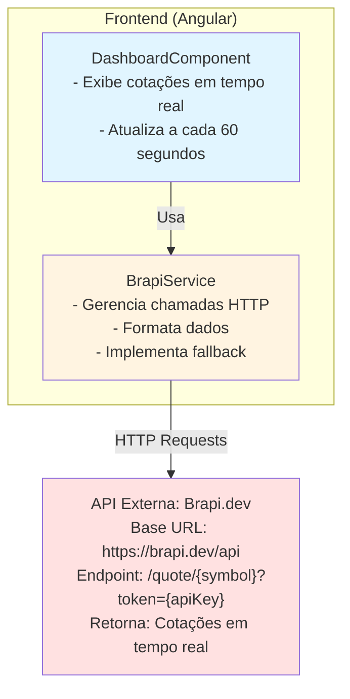
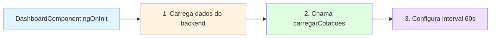
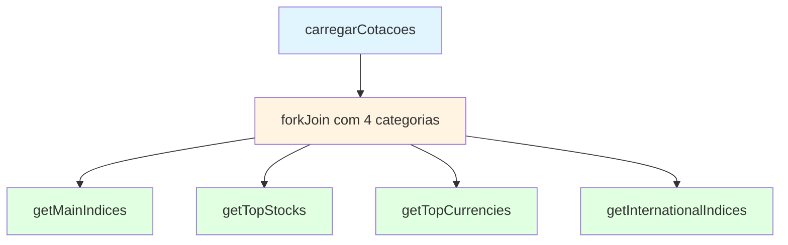
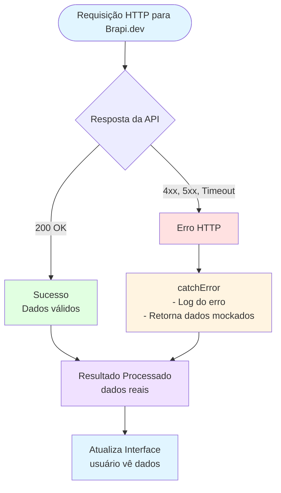

# 📡 Documentação: Integração com API Brapi.dev

## 📋 Índice

1. [Visão Geral](#visão-geral)
2. [Arquitetura da Integração](#arquitetura-da-integração)
3. [Fluxo de Dados](#fluxo-de-dados)
4. [Implementação Técnica](#implementação-técnica)
5. [Endpoints Utilizados](#endpoints-utilizados)
6. [Tratamento de Erros e Fallback](#tratamento-de-erros-e-fallback)
7. [Configuração](#configuração)
8. [Exemplos de Uso](#exemplos-de-uso)
9. [Diagramas de Fluxo](#diagramas-de-fluxo)
10. [Limitações e Considerações](#limitações-e-considerações)

---

## 🎯 Visão Geral

A integração com a **API Brapi.dev** permite ao sistema **BartoFinance** exibir cotações de mercado em tempo real no dashboard, incluindo:

- **Índices Principais**: Ibovespa, Dólar, Euro
- **Ações Mais Negociadas**: PETR4, VALE3, ITUB4, BBDC4, MGLU3, B3SA3
- **Moedas (Câmbio)**: Dólar, Euro, Libra, Iene, Yuan, Franco Suíço, Dólar Canadense, Dólar Australiano
- **Índices Internacionais**: S&P 500, Dow Jones, Nasdaq, Nikkei 225, FTSE 100, Bitcoin, Ethereum, Ouro

### Características Principais

- ✅ **Integração Frontend**: Chamadas diretas do Angular para a API Brapi.dev
- ✅ **Atualização Automática**: Cotações atualizadas a cada 1 minuto
- ✅ **Fallback Inteligente**: Dados mockados em caso de falha na API
- ✅ **Plano Free**: Otimizado para plano gratuito (1 ação por requisição)
- ✅ **Tratamento de Erros**: Logs detalhados e recuperação automática

---

## 🏗️ Arquitetura da Integração

### Componentes Envolvidos



### Fluxo de Comunicação

1. **Frontend (Angular)** → Faz requisições HTTP para Brapi.dev
2. **Brapi.dev** → Retorna dados JSON com cotações
3. **BrapiService** → Processa e formata os dados
4. **DashboardComponent** → Exibe as cotações na interface

---

## 🔄 Fluxo de Dados

### 1. Inicialização do Dashboard



### 2. Carregamento de Cotações



### 3. Processamento Paralelo

```mermaid
flowchart TD
    Start[Para cada categoria] --> GetQuotes[BrapiService.getQuotes]
    
    GetQuotes --> ForEach[Para cada símbolo]
    ForEach --> BuildURL[1. Monta URL<br/>https://brapi.dev/api/quote/{symbol}?token={key}]
    BuildURL --> HTTPRequest[2. Requisição HTTP axios]
    
    HTTPRequest --> CheckResult{Resultado?}
    CheckResult -->|Sucesso| Extract[Extrai results[0]]
    CheckResult -->|Erro| Fallback[Retorna dados mockados]
    
    Extract --> Combine[forkJoin combina resultados]
    Fallback --> Combine
    
    Combine --> Format[2. Formata dados]
    Format --> Update[3. Atualiza signals]
    Update --> Render[4. Renderiza interface]
    
    style Start fill:#e1f5ff
    style GetQuotes fill:#fff4e1
    style HTTPRequest fill:#ffe1e1
    style Fallback fill:#ffe1e1
    style Combine fill:#e1ffe1
    style Render fill:#f0e1ff
```

---

## 💻 Implementação Técnica

### Estrutura de Arquivos

```
bartofinance-frontend/
└── src/
    └── app/
        ├── core/
        │   └── services/
        │       └── brapi.service.ts          # Serviço principal
        └── features/
            └── dashboard/
                ├── dashboard.component.ts     # Componente que usa o serviço
                └── dashboard.component.html   # Template com exibição
```

### BrapiService - Principais Métodos

#### 1. `getQuotes(symbols: string[]): Observable<BrapiResponse>`

**Descrição**: Busca cotações de múltiplos ativos.

**Implementação**:
```typescript
getQuotes(symbols: string[]): Observable<BrapiResponse> {
  // Para o plano free, fazemos uma requisição por ação
  const requests = symbols.map(symbol => {
    const url = `${this.API_URL}/quote/${symbol}?token=${this.API_KEY}`;
    
    return from(axios.get<BrapiResponse>(url))
      .pipe(
        map(response => response.data.results[0]),
        catchError((error: AxiosError) => {
          console.error(`❌ [BRAPI] Erro ao buscar ${symbol}:`, error.response?.status);
          return of(this.getMockData([symbol]).results[0]);
        })
      );
  });
  
  // forkJoin combina todos os Observables
  return forkJoin(requests)
    .pipe(
      map((results: BrapiQuote[]) => ({
        results: results.filter(r => r !== null && r !== undefined),
        requestedAt: new Date().toISOString(),
        took: '0ms'
      })),
      catchError(() => of(this.getMockData(symbols)))
    );
}
```

**Características**:
- ✅ Faz uma requisição por símbolo (limitação do plano free)
- ✅ Usa `forkJoin` para executar requisições em paralelo
- ✅ Implementa fallback automático em caso de erro
- ✅ Filtra resultados nulos/indefinidos

#### 2. Métodos Especializados

```typescript
// Índices principais (Ibovespa, Dólar, Euro)
getMainIndices(): Observable<BrapiResponse>

// Ações mais negociadas
getTopStocks(): Observable<BrapiResponse>

// Moedas (câmbio)
getTopCurrencies(): Observable<BrapiResponse>

// Índices internacionais
getInternationalIndices(): Observable<BrapiResponse>
```

#### 3. Métodos de Formatação

```typescript
// Formata preço com moeda
formatPrice(price: number, currency: string = 'BRL'): string

// Formata variação percentual
formatPercent(percent: number): string

// Retorna classe CSS baseada na variação
getVariationClass(change: number): string

// Retorna ícone baseado na variação
getVariationIcon(change: number): string

// Formata volume (K, M, B)
formatVolume(volume: number): string

// Formata market cap
formatMarketCap(marketCap: number): string
```

### DashboardComponent - Uso do Serviço

```typescript
export class DashboardComponent implements OnInit, OnDestroy {
  // Signals para armazenar cotações
  marketQuotes = signal<BrapiQuote[]>([]);
  topStocks = signal<BrapiQuote[]>([]);
  currencies = signal<BrapiQuote[]>([]);
  internationalIndices = signal<BrapiQuote[]>([]);
  
  private quotesSubscription?: Subscription;

  ngOnInit(): void {
    this.carregarCotacoes();
    
    // Atualizar cotações a cada 1 minuto
    this.quotesSubscription = interval(60000).subscribe(() => {
      this.carregarCotacoes();
    });
  }

  carregarCotacoes(): void {
    this.loadingQuotes.set(true);

    forkJoin({
      indices: this.brapiService.getMainIndices(),
      stocks: this.brapiService.getTopStocks(),
      currencies: this.brapiService.getTopCurrencies(),
      international: this.brapiService.getInternationalIndices()
    }).subscribe({
      next: (response) => {
        this.marketQuotes.set(response.indices.results || []);
        this.topStocks.set(response.stocks.results || []);
        this.currencies.set(response.currencies.results || []);
        this.internationalIndices.set(response.international.results || []);
        this.loadingQuotes.set(false);
      },
      error: (error) => {
        console.error('Erro ao carregar cotações:', error);
        this.loadingQuotes.set(false);
      }
    });
  }
}
```

---

## 🌐 Endpoints Utilizados

### API Brapi.dev

#### Base URL
```
https://brapi.dev/api
```

#### Endpoint de Cotações
```
GET /quote/{symbol}?token={apiKey}
```

**Parâmetros**:
- `symbol`: Símbolo do ativo (ex: `PETR4`, `^BVSP`, `USDBRL=X`)
- `token`: Chave de API (obtida de `environment.brapiApiKey`)

**Exemplo de Requisição**:
```http
GET https://brapi.dev/api/quote/PETR4?token=mJeXMvgNvQzTF9CPSTrSLU
```

**Exemplo de Resposta**:
```json
{
  "results": [
    {
      "symbol": "PETR4",
      "shortName": "Petrobras PN",
      "longName": "Petróleo Brasileiro S.A. - Petrobras",
      "currency": "BRL",
      "regularMarketPrice": 38.45,
      "regularMarketChange": 0.75,
      "regularMarketChangePercent": 1.99,
      "regularMarketTime": "2025-01-21T15:30:00Z",
      "marketCap": 500000000000,
      "regularMarketVolume": 50000000,
      "regularMarketPreviousClose": 37.70,
      "regularMarketOpen": 37.80,
      "regularMarketDayHigh": 38.60,
      "regularMarketDayLow": 37.65,
      "logourl": "https://..."
    }
  ],
  "requestedAt": "2025-01-21T15:30:00Z",
  "took": "150ms"
}
```

### Símbolos Utilizados

#### Índices Principais
- `^BVSP` - Ibovespa
- `USDBRL=X` - Dólar Americano / Real
- `EURBRL=X` - Euro / Real

#### Ações Mais Negociadas
- `PETR4` - Petrobras PN
- `VALE3` - Vale ON
- `ITUB4` - Itaú Unibanco PN
- `BBDC4` - Bradesco PN
- `MGLU3` - Magazine Luiza ON
- `B3SA3` - B3 ON

#### Moedas
- `USDBRL=X` - Dólar
- `EURBRL=X` - Euro
- `GBPBRL=X` - Libra Esterlina
- `JPYBRL=X` - Iene Japonês
- `CNYBRL=X` - Yuan Chinês
- `CHFBRL=X` - Franco Suíço
- `CADBRL=X` - Dólar Canadense
- `AUDBRL=X` - Dólar Australiano

#### Índices Internacionais
- `^GSPC` - S&P 500
- `^DJI` - Dow Jones
- `^IXIC` - Nasdaq Composite
- `^N225` - Nikkei 225 (Japão)
- `^FTSE` - FTSE 100 (Reino Unido)
- `BTC-USD` - Bitcoin
- `ETH-USD` - Ethereum
- `GC=F` - Ouro (Gold Futures)

---

## 🛡️ Tratamento de Erros e Fallback

### Estratégia de Fallback

O sistema implementa uma estratégia robusta de fallback em múltiplas camadas:

#### 1. Nível de Requisição Individual

```typescript
catchError((error: AxiosError) => {
  console.error(`❌ [BRAPI] Erro ao buscar ${symbol}:`, error.response?.status);
  return of(this.getMockData([symbol]).results[0]);
})
```

**Cenários tratados**:
- ❌ Erro de rede (timeout, conexão perdida)
- ❌ Erro HTTP (404, 500, 429 - rate limit)
- ❌ Símbolo inválido ou não encontrado
- ❌ API indisponível

#### 2. Nível de Agregação

```typescript
catchError(() => of(this.getMockData(symbols)))
```

Se todas as requisições falharem, retorna dados mockados completos.

### Dados Mockados

O sistema mantém um conjunto de dados mockados para cada símbolo, permitindo que a aplicação continue funcionando mesmo quando a API está indisponível.

**Exemplo de Dados Mockados**:
```typescript
'PETR4': {
  symbol: 'PETR4',
  shortName: 'Petrobras PN',
  longName: 'Petróleo Brasileiro S.A. - Petrobras',
  currency: 'BRL',
  regularMarketPrice: 38.45,
  regularMarketChange: 0.75,
  regularMarketChangePercent: 1.99,
  regularMarketTime: new Date().toISOString(),
  marketCap: 500000000000,
  regularMarketVolume: 50000000,
  regularMarketPreviousClose: 37.70,
  regularMarketOpen: 37.80,
  regularMarketDayHigh: 38.60,
  regularMarketDayLow: 37.65
}
```

### Logs e Monitoramento

O sistema registra logs detalhados para facilitar o debug:

```typescript
console.log('📡 [BRAPI] Buscando:', symbols.join(', '));
console.log('⚠️ [BRAPI] Free tier: fazendo 1 requisição por ação');
console.error(`❌ [BRAPI] Erro ao buscar ${symbol}:`, error.response?.status);
```

---

## ⚙️ Configuração

### Variáveis de Ambiente

#### Desenvolvimento (`environment.ts`)

```typescript
export const environment = {
  production: false,
  apiUrl: 'http://localhost:8080',
  // Brapi API Key - 10.000 requisições/mês gratuitas
  brapiApiKey: 'mJeXMvgNvQzTF9CPSTrSLU'
};
```

#### Produção (`environment.prod.ts`)

```typescript
export const environment = {
  production: true,
  apiUrl: 'http://localhost:8080', // Alterar para URL de produção
  brapiApiKey: '' // Adicione sua chave da Brapi em produção
};
```

### Obter Chave de API

1. Acesse: https://brapi.dev/
2. Crie uma conta gratuita
3. Obtenha sua chave de API no painel
4. Configure no arquivo `environment.ts` ou `environment.prod.ts`

### Limites do Plano Free

- ✅ **10.000 requisições/mês**
- ⚠️ **1 ação por requisição** (limitação importante)
- ✅ Dados em tempo real
- ✅ Suporte a ações, índices, moedas, criptomoedas

---

## 📝 Exemplos de Uso

### Exemplo 1: Buscar Cotação de uma Ação

```typescript
// No componente
this.brapiService.getQuote('PETR4').subscribe({
  next: (response) => {
    const quote = response.results[0];
    console.log(`Preço: R$ ${quote.regularMarketPrice}`);
    console.log(`Variação: ${quote.regularMarketChangePercent}%`);
  },
  error: (error) => {
    console.error('Erro ao buscar cotação:', error);
  }
});
```

### Exemplo 2: Buscar Múltiplas Cotações

```typescript
const symbols = ['PETR4', 'VALE3', 'ITUB4'];

this.brapiService.getQuotes(symbols).subscribe({
  next: (response) => {
    response.results.forEach(quote => {
      console.log(`${quote.symbol}: R$ ${quote.regularMarketPrice}`);
    });
  }
});
```

### Exemplo 3: Formatação de Dados

```typescript
const quote = response.results[0];

// Formatar preço
const precoFormatado = this.brapiService.formatPrice(
  quote.regularMarketPrice, 
  quote.currency
);
// Resultado: "R$ 38,45"

// Formatar variação
const variacaoFormatada = this.brapiService.formatPercent(
  quote.regularMarketChangePercent
);
// Resultado: "+1.99%"

// Obter classe CSS
const classeVariacao = this.brapiService.getVariationClass(
  quote.regularMarketChange
);
// Resultado: "text-green-600" ou "text-red-600"

// Obter ícone
const icone = this.brapiService.getVariationIcon(
  quote.regularMarketChange
);
// Resultado: "📈" ou "📉"
```

### Exemplo 4: Uso no Template HTML

```html
<div *ngFor="let quote of marketQuotes()">
  <div class="quote-card">
    <h3>{{ quote.shortName }}</h3>
    <p class="price">
      {{ brapiService.formatPrice(quote.regularMarketPrice, quote.currency) }}
    </p>
    <p [class]="brapiService.getVariationClass(quote.regularMarketChange)">
      {{ brapiService.formatPercent(quote.regularMarketChangePercent) }}
    </p>
    <span>{{ brapiService.getVariationIcon(quote.regularMarketChange) }}</span>
  </div>
</div>
```

---

## 📊 Diagramas de Fluxo

### Fluxo Completo: Carregamento de Cotações

```mermaid
flowchart TD
    Start([Usuário Acessa Dashboard]) --> OnInit[DashboardComponent.ngOnInit<br/>- Inicializa componente<br/>- Chama carregarCotacoes<br/>- Configura interval 60s]
    
    OnInit --> CarregarCotacoes[carregarCotacoes<br/>- Define loadingQuotes = true<br/>- Executa forkJoin com 4 categorias]
    
    CarregarCotacoes --> ForkJoin{forkJoin<br/>4 categorias}
    
    ForkJoin --> Indices[getMainIndices]
    ForkJoin --> Stocks[getTopStocks]
    ForkJoin --> Currencies[getTopCurrencies]
    ForkJoin --> International[getInternationalIndices]
    
    Indices --> GetQuotes1[BrapiService.getQuotes]
    Stocks --> GetQuotes2[BrapiService.getQuotes]
    Currencies --> GetQuotes3[BrapiService.getQuotes]
    International --> GetQuotes4[BrapiService.getQuotes]
    
    GetQuotes1 --> ProcessSymbols[Para cada símbolo:<br/>1. Monta URL<br/>2. Requisição HTTP axios<br/>3. Processa resposta]
    GetQuotes2 --> ProcessSymbols
    GetQuotes3 --> ProcessSymbols
    GetQuotes4 --> ProcessSymbols
    
    ProcessSymbols --> CheckResponse{Resposta?}
    CheckResponse -->|Sucesso| ExtractData[Extrai results[0]]
    CheckResponse -->|Erro| MockData[Retorna dados mockados]
    
    ExtractData --> CombineResults[forkJoin combina resultados<br/>Filtra nulos]
    MockData --> CombineResults
    
    CombineResults --> UpdateSignals[Atualiza signals:<br/>- marketQuotes<br/>- topStocks<br/>- currencies<br/>- internationalIndices<br/>loadingQuotes = false]
    
    UpdateSignals --> Render[Renderiza no Template HTML<br/>- Exibe cards<br/>- Formata valores<br/>- Aplica classes CSS<br/>- Mostra ícones]
    
    Render --> Interval[interval 60000 dispara]
    Interval --> CarregarCotacoes
    
    style Start fill:#e1f5ff
    style OnInit fill:#fff4e1
    style CarregarCotacoes fill:#e1ffe1
    style ProcessSymbols fill:#ffe1e1
    style UpdateSignals fill:#f0e1ff
    style Render fill:#e1f5ff
```

### Fluxo de Tratamento de Erros



---

## ⚠️ Limitações e Considerações

### Limitações do Plano Free

1. **1 Ação por Requisição**
   - O plano free permite apenas 1 símbolo por requisição
   - Solução implementada: múltiplas requisições paralelas com `forkJoin`

2. **10.000 Requisições/Mês**
   - Limite mensal de requisições
   - Com atualização a cada 60s: ~43.200 requisições/dia
   - **Recomendação**: Aumentar intervalo ou implementar cache

3. **Rate Limiting**
   - API pode limitar requisições muito frequentes
   - Implementar retry com backoff exponencial (futuro)

### Melhorias Futuras

#### 1. Cache de Cotações
```typescript
// Implementar cache local (localStorage ou IndexedDB)
// Reduzir número de requisições à API
```

#### 2. Backend Proxy
```typescript
// Criar endpoint no backend que:
// - Faz requisições para Brapi.dev
// - Implementa cache server-side
// - Reduz carga no frontend
```

#### 3. WebSocket (Plano Pago)
```typescript
// Se migrar para plano pago:
// - Usar WebSocket para atualizações em tempo real
// - Reduzir latência
// - Melhor experiência do usuário
```

#### 4. Retry com Backoff
```typescript
// Implementar retry automático com backoff exponencial
// Em caso de erro temporário (429, 500, timeout)
```

### Considerações de Performance

1. **Requisições Paralelas**
   - ✅ Uso de `forkJoin` otimiza tempo de resposta
   - ⚠️ Muitas requisições simultâneas podem causar rate limiting

2. **Atualização Automática**
   - ⚠️ Atualização a cada 60s pode exceder limite mensal
   - ✅ Considerar aumentar intervalo (ex: 5 minutos)

3. **Fallback**
   - ✅ Dados mockados garantem continuidade
   - ⚠️ Dados podem ficar desatualizados em caso de falha prolongada

---

## 📚 Referências

### Documentação Oficial

- **Brapi.dev**: https://brapi.dev/docs
- **API Reference**: https://brapi.dev/api/docs

### Tecnologias Utilizadas

- **Angular**: https://angular.io/docs
- **RxJS**: https://rxjs.dev/
- **Axios**: https://axios-http.com/

---

## ✅ Checklist de Implementação

- [x] Configuração da chave de API
- [x] Implementação do BrapiService
- [x] Integração com DashboardComponent
- [x] Tratamento de erros e fallback
- [x] Formatação de dados (preço, variação, volume)
- [x] Atualização automática (interval)
- [x] Dados mockados para fallback
- [x] Logs para debug
- [ ] Cache de cotações (futuro)
- [ ] Backend proxy (futuro)
- [ ] Retry com backoff (futuro)

---

## 📞 Suporte

Para dúvidas ou problemas com a integração:

1. Verificar logs no console do navegador
2. Verificar status da API Brapi.dev: https://status.brapi.dev/
3. Consultar documentação oficial: https://brapi.dev/docs
4. Verificar limite de requisições no painel da Brapi.dev

---

**Versão do Documento**: 1.0.0  
**Última Atualização**: Janeiro 2025  
**Autor**: Equipe BartoFinance

